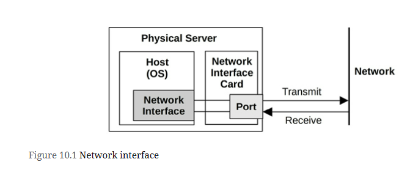
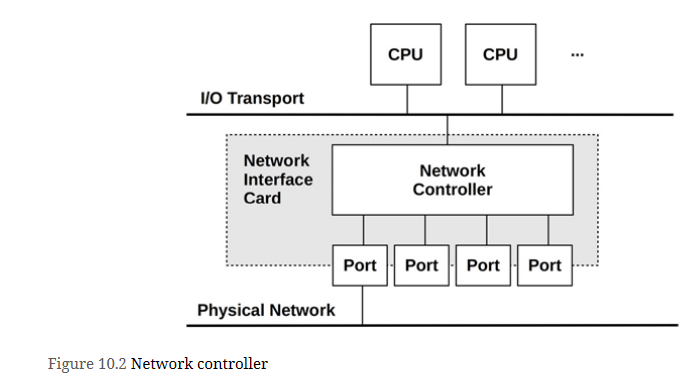
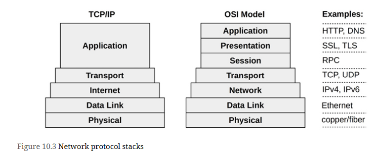
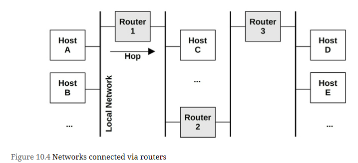
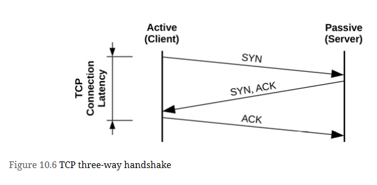
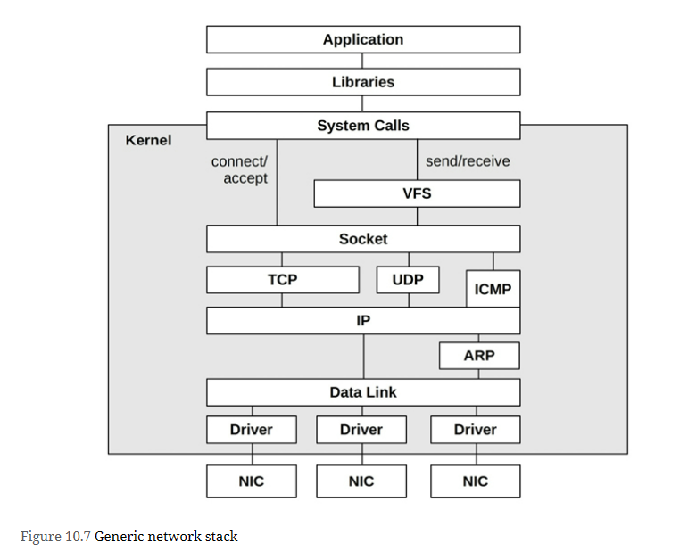
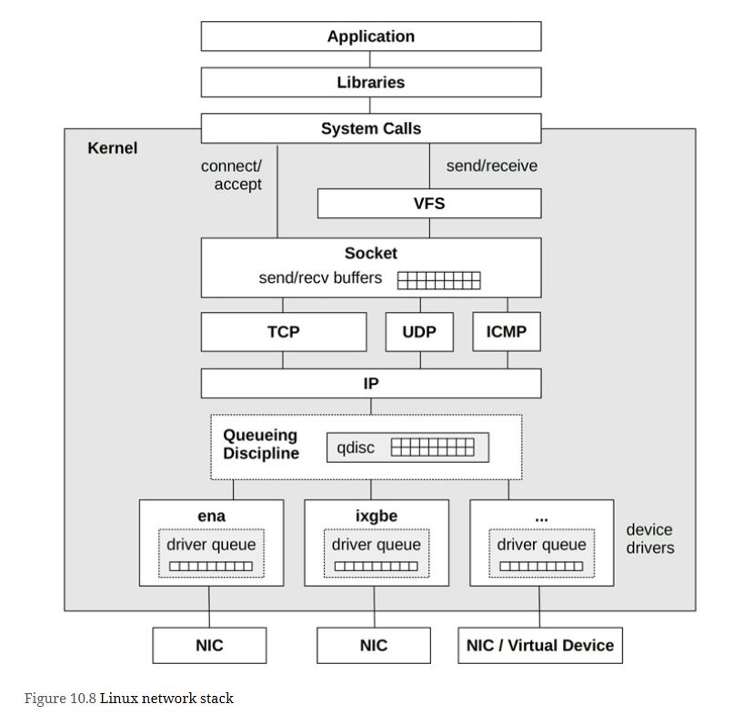
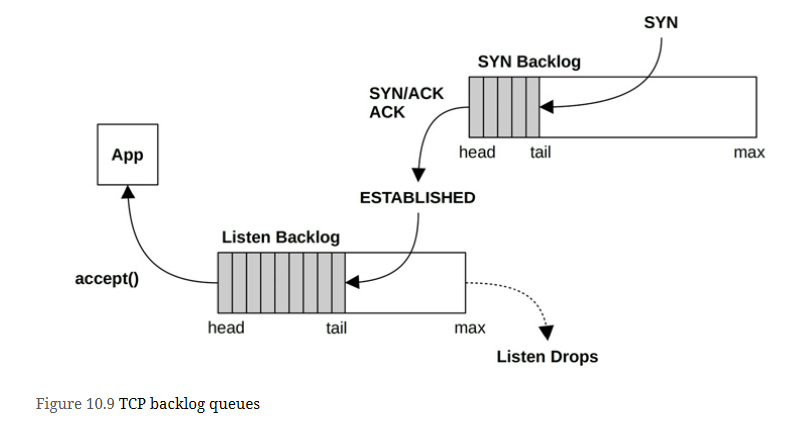
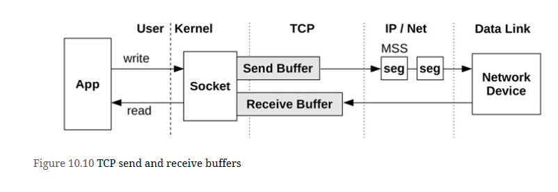
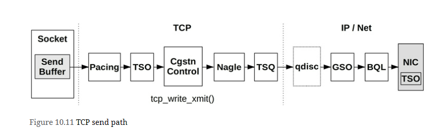

As systems become more distributed, especially with cloud computing environments, the network plays a bigger role in performance. Common tasks in network performance include improving network latency and throughput, and eliminating latency outliers, which can be caused by dropped or delayed packets.

Network analysis spans hardware and software - 
- hardware is the physical network, which includes the network interface cards, switches, routers, and gateways (these typically have software, too)
- software is the kernel network stack including network device drivers, packet queues, and packet schedulers, and the implementation of network protocols. Lower-level protocols are typically kernel software (IP, TCP, UDP, etc.) and higher-level protocols are typically library or application software (e.g., HTTP)

# Terminology
**Interface**: The term interface port refers to the physical network connector. The term interface or link refers to the logical instance of a network interface port, as seen and configured by the OS. (Not all OS interfaces are backed by hardware: some are virtual.)

**Packet**: The term packet refers to a message in a packet-switched network, such as IP packets.

**Frame**: A physical network-level message, for example an Ethernet frame.

**Socket**: An API originating from BSD for network endpoints.

**Bandwidth**: The maximum rate of data transfer for the network type, usually measured in bits per second.

**Throughput**: The current data transfer rate between the network endpoints, measured in bits per second or bytes per second.

**Latency**: Network latency can refer to the time it takes for a message to make a round-trip between endpoints, or the time required to establish a connection (e.g., TCP handshake), excluding the data transfer time that follows.

# Models
## Network Interface


Network Interface 
- is an operating system endpoint for network connections
- are mapped to physical network ports as part of their configuration. Ports connect to the network and typically have separate transmit and receive channels.

## Controller


provides one or more network ports for the system and houses a network controller: a microprocessor for transferring packets between the ports and the system I/O transport. An example controller with four ports is pictured

## Protocol Stack


# Concepts
## Networking and Routing


Host A can connect to host B via the local network, usually driven by a network switch. Host A can connect to host C via router 1, and to host D via routers 1, 2, and 3. Since network components such as routers are shared, contention from other traffic (e.g., host C to host E) can hurt performance.

Connections between pairs of hosts involve unicast transmission. Multicast transmission allows a sender to transmit to multiple destinations simultaneously, which may span multiple networks. This must be supported by the router configuration to allow delivery. In public cloud environments it may be blocked.

## Protocols
Network protocol standards, such as those for IP, TCP, and UDP, are a necessary requirement for communication between systems and devices. 

Other protocols perform differently by design, and may be selected when they suit the workload: examples include *Stream Control Transmission Protocol* (SCTP), *Multipath TCP* (MPTCP), and *QUIC*

## Packet Size
- For TCP/IP and Ethernet, packets can be between 54 and 9,054 bytes, including the 54 bytes (or more, depending on options or version) of protocol headers.
- Packet size is usually limited by the network interface maximum transmission unit (MTU) size, which for many Ethernet networks is configured to be 1,500 bytes.
- Ethernet now supports larger packets (frames) of up to approximately 9,000 bytes, termed jumbo frames. These can improve network throughput performance, as well as the latency of data transfers, by requiring fewer packets.
- The performance of 1,500 MTU frames has been improved by network interface card features, including TCP offload and large segment offload. These send larger buffers to the network card, which can then split them into smaller frames using dedicated and optimized hardware. This has, to some degree, narrowed the gap between 1,500 and 9,000 MTU network performance.

## Latency
can be measured in different ways
-  name resolution latency
-  ping latency, connection latency
-  first-byte latency
-  round-trip time
-  connection life span

These are described as measured by a client connecting to a server

### Name Resolution Strategy
Establishing connections to remote hosts, a host name is usually resolved to an IP address, for example, by DNS resolution. The time this takes can be measured separately as name resolution latency.

### Ping Latency
This is the time for an ICMP echo request to echo response, as measured by the ping(1) command. This time is used to measure network latency between hosts, including hops in between, and is measured as the time needed for a network request to make a round-trip

### Connection Latency
Connection latency is the time to establish a network connection, before any data is transferred. For TCP connection latency, this is the TCP handshake time. Measured from the client, it is the time from sending the SYN to receiving the corresponding SYN-ACK. Connection latency might be better termed connection establishment latency to clearly differentiate it from connection life span.

Connection latency is similar to ping latency, although it exercises more kernel code to establish a connection and includes time to retransmit any dropped packets. The TCP SYN packet, in particular, can be dropped by the server if its backlog is full, causing the client to send a timer-based retransmit of the SYN. This occurs during the TCP handshake, so connection latency can include retransmission latency, adding one or more seconds.

Connection latency is followed by first-byte latency.

### First-Byte Latency
Also known as **time to first byte (TTFB)**, first-byte latency is the time from when the connection has been established to when the first byte of data is received. This includes the time for the remote host to accept a connection, schedule the thread that services it, and for that thread to execute and send the first byte.

While ping and connection latency measures the latency incurred by the network, first-byte latency includes the think time of the target server. This may include latency if the server is overloaded and needs time to process the request (e.g., TCP backlog) and to schedule the server (CPU scheduler latency).

### Round Trip Time
Round-trip time (RTT) describes the time needed for a network request to make a round trip between the endpoints. This includes the signal propagation time and the processing time at each network hop. The intended use is to determine the latency of the network, so ideally RTT is dominated by the time that the request and reply packets spend on the network (and not the time the remote host spends servicing the request). RTT for ICMP echo requests is often studied, as the remote host processing time is minimal.

### Connection Life Span
Connection life span is the time from when a network connection is established to when it is closed. Some protocols use a keep-alive strategy, extending the duration of connections so that future operations can use existing connections and avoid the overheads and latency of connection establishment (and TLS establishment).

## Buffering
TCP employs buffering, along with a sliding send window, to improve throughput. Network sockets also have buffers, and applications may also employ their own, to aggregate data before sending.

Buffering can also be performed by external network components, such as switches and routers, in an effort to improve their own throughput. Unfortunately, the use of large buffers on these components can lead to *bufferbloat*, where packets are queued for long intervals. This causes TCP congestion avoidance on the hosts, which throttles performance.

## Connection Backlog
TCP implements a backlog, where SYN requests can queue in the kernel before being accepted by the user-land process. When there are too many TCP connection requests for the process to accept in time, the backlog reaches a limit and SYN packets are dropped, to be later retransmitted by the client. The retransmission of these packets causes latency for the client connect time. The limit is tunable: it is a parameter of the *listen(2) syscall*, and the kernel may also provide system-wide limits.

Backlog drops and SYN retransmits are indicators of host overload.

## Congestion Avoidance
Networks are shared resources that can become congested when traffic loads are high. This can cause performance problems: for example, routers or switches may drop packets, causing latency-inducing TCP retransmits. Hosts can also become overwhelmed when receiving high packet rates, and may drop packets themselves.

There are many mechanisms to avoid these problems; these mechanisms should be studied, and tuned if necessary, to improve scalability under load. Examples for different protocols include:

- Ethernet: An overwhelmed host may send pause frames to a transmitter, requesting that they pause transmission (IEEE 802.3x). There are also priority classes and priority pause frames for each class.
- IP: Includes an Explicit Congestion Notification (ECN) field.
- TCP: Includes a congestion window, and various congestion control algorithms may be used.

## Local Connections
Connecting via IP to localhost is the IP sockets technique of *inter-process communication (IPC)*. Another technique is *Unix domain sockets (UDS)*, which create a file on the file system for communication. Performance may be better with UDS, as the kernel TCP/IP stack can be bypassed, skipping kernel code and the overheads of protocol packet encapsulation.

For *TCP/IP sockets*, the kernel may detect the localhost connection after the handshake, and then shortcut the TCP/IP stack for data transfers, improving performance. This was developed as a Linux kernel feature, called *TCP friends*, but was not merged [Corbet 12]. BPF can now be used on Linux for this purpose, as is done by the Cilium software for container networking performance and security [Cilium 20a].

# Architecture
## IP

## TCP
TCP can provide a high rate of throughput even on high-latency networks, by use of buffering and a sliding window. TCP also employs congestion control and a congestion window set by the sender, so that it can maintain a high but also reliable rate of transmission across different and varying networks. Congestion control avoids sending too many packets, which would cause congestion and a performance breakdown.

Important topics for TCP performance include the three-way handshake, duplicate ACK detection, congestion control algorithms, Nagle, delayed ACKs, SACK, and FACK.

### 3 way handshake


Connection latency from the client is indicated, which completes when the final ACK is sent. After that, data transfer may begin.

This figure shows best-case latency for a handshake. A packet may be dropped, adding latency as it is timed out and retransmitted.

Once the three-way handshake is complete, the TCP session is placed in the ESTABLISHED state.

### States and Timers
TCP sessions switch between TCP states based on packets and socket events. The states are LISTEN, SYN-SENT, SYN-RECEIVED, ESTABLISHED, FIN-WAIT-1, FIN-WAIT-2, CLOSE-WAIT, CLOSING, LAST-ACK, TIME-WAIT, and CLOSED [Postal 80]. Performance analysis typically focuses on those in the ESTABLISHED state, which are the active connections. Such connections may be transferring data, or idle awaiting the next 
event: a data transfer or close event.

A session that has fully closed enters the TIME_WAIT2 state so that late packets are not mis-associated with a new connection on the same ports. This can lead to a performance issue of port exhaustion.

Some states have timers associated with them. TIME_WAIT is typically two minutes (some kernels, such as the Windows kernel, allow it to be tuned). There may also be a “keep alive” timer on ESTABLISHED, set to a long duration (e.g., two hours), to trigger probe packets to check that the remote host is still alive.

### Duplicate ACK Detection
Duplicate ACK detection is used by the fast retransmit and fast recovery algorithms to quickly detect when a sent packet (or its ACK) has been lost. It works as follows:
- The sender sends a packet with sequence number 10.
- The receiver replies with an ACK for sequence number 11.
- The sender sends 11, 12, and 13.
- Packet 11 is dropped.
- The receiver replies to both 12 and 13 by sending an ACK for 11, which it is still expecting.
- The sender receives the duplicate ACKs for 11.

Duplicate ACK detection is also used by various congestion avoidance algorithms.

### Retransmits
Two commonly used mechanisms for TCP to detect and retransmits lost packets are:

- Timer-based retransmits: These occur when a time has passed and a packet acknowledgment has not yet been received. This time is the TCP retransmit timeout, calculated dynamically based on the connection *round-trip time (RTT)*. On Linux, this will be at least *200 ms (TCP_RTO_MIN)* for the first retransmit,3 and subsequent retransmits will be much slower, following an exponential backoff algorithm that doubles the timeout.

- Fast retransmits: When duplicate ACKs arrive, TCP can assume that a packet was dropped and retransmit it immediately.

To further improve performance, additional mechanisms have been developed to avoid the timer-based retransmit. One problem occurs is when the last transmitted packet is lost, and there are no subsequent packets to trigger duplicate ACK detection. (Consider the prior example with a loss on packet 13.) This is solved by Tail Loss Probe (TLP), which sends an additional packet (probe) after a short timeout on the last transmission to help detect packet loss

### Congestion Controls
Congestion control algorithms have been developed to maintain performance on congested networks. Some operating systems (including Linux-based) allow the algorithm to be selected as part of system tuning. These algorithms include:
- Reno
- Tahoe
- CUBIC
- BBR (Used by Netflix)
- DCTCP

The congestion control algorithm can make a large difference to network performance. The Netflix cloud services, for example, use BBR and found it can improve throughput threefold during heavy packet loss. Understanding how these algorithms react under different network conditions is an important activity when analyzing TCP performance.

Linux 5.6, released in 2020, added support for developing new congestion control algorithms in BPF [Corbet 20]. This allows them to be defined by the end user and loaded on demand.

### Initial Window
The initial window (IW) is the number of packets a TCP sender will transmit at the beginning of a connection before waiting for acknowledgment from the sender. For short flows, such as typical **HTTP** connections, an IW large enough to span the transmitted data can **greatly reduce completion time, improving performance**. Larger IWs, however, can risk congestion and packet drops. This is especially compounded when multiple flows start up at the same time.

The Linux default (10 packets, aka IW10) can be too high on slow links or when many connections start up; other operating systems default to 2 or 4 packets (IW2 or IW4).

## UDP
A major use for UDP has been DNS. Due to the simplicity of UDP, a lack of congestion control, and Internet support (it is not typically firewalled) there are now new protocols built upon UDP that implement their own congestion control and other features. An example is **QUIC**.

## QUIC and HTTP/3
QUIC is a network protocol designed by Jim Roskind at Google as a higher-performing, lower-latency alternative to TCP, optimized for HTTP and TLS 

QUIC is built upon UDP, and provides several features on top of it, including:
- The ability to multiplex several application-defined streams on top of the same “connection.”
- A TCP-like reliable in-order stream transport that can be optionally turned off for individual substreams.
- Connection resumption when a client changes its network address, based on cryptographic authentication of connection IDs.
- Full encryption of the payload data, including QUIC headers.
- 0-RTT connection handshakes including cryptography (for peers that have previously communicated).

QUIC is in heavy use by the Chrome web browser.

# Hardware
Networking hardware includes interfaces, controllers, switches, routers, and firewalls. An understanding of their operation is useful, even if they are managed by other staff

## Interfaces
Interface types are based on layer 2 standards, each providing a maximum bandwidth. Higher-bandwidth interfaces provide lower data-transfer latency, at a higher cost. When designing new servers, a key decision is often how to balance the price of the server with the desired network performance.

## Controllers
Physical network interfaces are provided to the system via controllers, either built into the system board or provided via expander cards.

Controllers are driven by microprocessors and are attached to the system via an I/O transport (e.g., PCI). Either of these can become the limiter for network throughput or IOPS.

## Switches and Routers
Switches provide a dedicated communication path between any two connected hosts, allowing multiple transmissions between pairs of hosts without interference. This technology replaced hubs 

Routers deliver packets between networks and use network protocols and routing tables to determine efficient delivery paths. Delivering a packet between two cities may involve a dozen or more routers, plus other network hardware. The routers and routes are usually configured to update dynamically, so that the network can automatically respond to network and router outages, and to balance load. This means that at a given point in time, no one can be sure what path a packet is actually taking. With multiple paths possible, there is also the potential for packets to be delivered out of order, which can cause TCP performance problems.

Network administration teams are therefore frequently required to exonerate their infrastructure. They can do so using advanced real-time monitoring tools to check all routers and other network components involved.

Both routers and switches include buffers and microprocessors, which themselves can become performance bottlenecks under load. As an extreme example, I once found that an early 10 GbE switch could drive no more than 11 Gbits/s in total across all ports, due to its limited CPU capacity.

Note that switches and routers are also often where rate transitions occur (switching from one bandwidth to another, e.g., a 10 Gbps link transitions to a 1 Gbps link). When this happens, some buffering is necessary to avoid excessive drops, but many switches and routers over-buffer (see the *bufferbloat* issue in Section 10.3.6, Buffering), leading to high latencies. Better queue management algorithms can help eliminate this problem, but not all network device vendors support them. Pacing at the source can also be a way to alleviate issues with rate transitions by making the traffic less bursty.

## Firewalls
Firewalls are often in use to permit only authorized communications based on a configured rule set, improving the security of the network. They may be present as both physical network devices and kernel software.

Firewalls can become a performance bottleneck, especially when configured to be stateful. Stateful rules store metadata for each seen connection, and the firewall may experience excessive memory load when processing many connections. This can happen due to a denial of service (DoS) attack that attempts to inundate a target with connections. It can also happen with a heavy rate of outbound connections, as they may require similar connection tracking.

As firewalls are custom hardware or software, the tools available to analyze them depends on each firewall product. See their respective documentation.

The use of extended BPF to implement firewalls on commodity hardware is growing, due to its performance, programmability, ease of use, and final cost. Companies adopting BPF firewalls and DDoS solutions include Facebook [Deepak 18], Cloudflare [Majkowski 18], and Cilium [Cilium 20a].


# Software
## Network Stack

### Generic Network Stack


### Linux Network Stack


On Linux systems, the network stack is a core kernel component, and device drivers are additional modules. Packets are passed through these kernel components as the struct *sk_buff* (socket buffer) data type. Note that there may also be queueing in the IP layer (not pictured) for packet reassembly.

The following sections discuss Linux implementation details related to performance: TCP connection queues, TCP buffering, queueing disciplines, network device drivers, CPU scaling, and kernel bypass. 

#### TCP Connection Queues
Bursts of inbound connections are handled by using backlog queues. There are two such queues, one for incomplete connections while the TCP handshake completes (also known as the SYN backlog), and one for established sessions waiting to be accepted by the application (also known as the listen backlog).



Only one queue was used in earlier kernels, and it was vulnerable to SYN floods. A SYN flood is a type of DoS attack that involves sending numerous SYNs to the listening TCP port from bogus IP addresses. This fills the backlog queue while TCP waits to complete the handshake, preventing real clients from connecting.

With two queues, the first can act as a staging area for potentially bogus connections, which are promoted to the second queue only once the connection is established. The first queue can be made long to absorb SYN floods and optimized to store only the minimum amount of metadata necessary.

The use of SYN cookies bypasses the first queue, as they show the client is already authorized.

The length of these queues can be tuned independently 

#### TCP Buffering
Data throughput is improved by using send and receive buffers associated with the socket.



The size of both the send and receive buffers is tunable. Larger sizes improve throughput performance, at the cost of more main memory spent per connection. One buffer may be set to be larger than the other if the server is expected to perform more sending or receiving. The Linux kernel will also dynamically increase the size of these buffers based on connection activity, and allows tuning of their minimum, default, and maximum sizes.

#### Queuing Discipline
This is an optional layer for managing traffic classification (tc), scheduling, manipulation, filtering, and shaping of network packets. Linux provides numerous queueing discipline algorithms (*qdiscs*), which can be configured using the tc(8) command.

Each has a man page, the man(1) command can be used to list them:

``` bash
man -k tc-
```

The Linux kernel sets *pfifo_fast* as the default qdisc, whereas systemd is less conservative and sets it to *fq_codel* to reduce potential *bufferbloat*, at the cost of slightly higher complexity in the *qdisc* layer.

*BPF* can enhance the capabilities of this layer with the programs of type *BPF_PROG_TYPE_SCHED_CLS* and *BPF_PROG_TYPE_SCHED_ACT*. These BPF programs can be attached to kernel ingress and egress points for packet filtering, mangling, and forwarding, as used by load balancers and firewalls.

#### Network Device Drivers
The network device driver usually has an additional buffer—a ring buffer—for sending and receiving packets between kernel memory and the NIC. This was pictured in above Figure driver queue.

A performance feature that has become more common with high-speed networking is the use of interrupt coalescing mode. Instead of interrupting the kernel for every arrived packet, an interrupt is sent only when either a timer (polling) or a certain number of packets is reached. This reduces the rate at which the kernel communicates with the NIC, allowing larger transfers to be buffered, resulting in greater throughput, though at some cost in latency.

The Linux kernel uses a new API (NAPI) framework that uses an interrupt mitigation technique: for low packet rates, interrupts are used (processing is scheduled via a softirq); for high packet rates, interrupts are disabled, and polling is used to allow coalescing [Corbet 03][Corbet 06b]. This provides low latency or high throughput, depending on the workload. Other features of NAPI include:
- Packet throttling, which allows early packet drop in the network adapter to prevent the system from being overwhelmed by packet storms.
- Interface scheduling, where a quota is used to limit the buffers processed in a polling cycle, to ensure fairness between busy network interfaces.
- Support for the *SO_BUSY_POLL* socket option, where user-level applications can reduce network receive latency by requesting to busy wait (spin on CPU until an event occurs) on a socket [Dumazet 17a].

Coalescing can be especially important for improving virtual machine networking, and is used by the ena network driver used by AWS EC2.

#### CPU Scaling
igh packet rates can be achieved by engaging multiple CPUs to process packets and the TCP/IP stack. Linux supports various methods for multi-CPU packet processing (see Documentation/networking/scaling.txt):
- RSS (Receive Side Scaling)
The Netflix FreeBSD CDN uses RSS to assist TCP large receive offload (LRO), allowing packets for the same connection to be aggregated, even when separated by other packets [Gallatin 17].
- RPS (Receive Packet Steering)
- RFS (Receive Flow Steering)
- Accelerated Receive FlowSteering
- XPS: Transmit Packet Steering

#### Kernel Bypass
Applications can bypass the kernel network stack using technologies such as the Data Plane Development Kit (DPDK) in order to achieve higher packet rates and performance. This involves an application implementing its own network protocols in user-space, and making writes to the network driver via a DPDK library and a kernel user space I/O (UIO) or virtual function I/O (VFIO) driver.

#### Other Network Optimizations
There are other algorithms in use throughout the Linux network stack to improve performance. Below Figure shows these for the TCP send path (many of these are called from the tcp_write_xmit() kernel function).



Some of these components and algorithms were described earlier (socket send buffers, TSO,9 congestion controls, Nagle, and qdiscs); others include:
- Pacing: This controls when to send packets, spreading out transmissions (pacing) to avoid bursts that may hurt performance (this may help avoid TCP micro-bursts that can lead to queueing delay, or even cause network switches to drop packets. It may also help with the incast problem, when many end points transmit to one at the same time [Fritchie 12]).

- TCP Small Queues (TSQ): This controls (reduces) how much is queued by the network stack to avoid problems including bufferbloat [Bufferbloat 20].

- Byte Queue Limits (BQL): These automatically size the driver queues large enough to avoid starvation, but also small enough to reduce the maximum latency of queued packets, and to avoid exhausting NIC TX descriptors [Hrubý 12]. It works by pausing the addition of packets to the driver queue when necessary, and was added in Linux 3.3 [Siemon 13].

- Earliest Departure Time (EDT): This uses a timing wheel instead of a queue to order packets sent to the NIC. Timestamps are set on every packet based on policy and rate configuration. This was added in Linux 4.20, and has BQL- and TSQ-like capabilities [Jacobson 18].

# Methodology
## Tools Method
tools method is a process of iterating over available tools, examining key metrics they provide. It may overlook issues for which the tools provide poor or no visibility, and it can be time-consuming to perform.
For networking, the tools method can involve checking:

- _**nstat/netstat -s**_: Look for a high rate of retransmits and out-of-order packets. What constitutes a “high” retransmit rate depends on the clients: an Internet-facing system with unreliable remote clients should have a higher retransmit rate than an internal system with clients in the same data center.

- _**ip -s link/netstat -i**_: Check interface error counters, including “errors,” “dropped,” “overruns.”

- _**ss -tiepm**_: Check for the limiter flag for important sockets to see what their bottleneck is, as well as other statistics showing socket health.

- _**nicstat/ip -s link**_: Check the rate of bytes transmitted and received. High throughput may be limited by a negotiated data link speed, or an external network throttle. It could also cause contention and delays between network users on the system.

- _**tcplife**_: Log TCP sessions with process details, duration (lifespan), and throughput statistics.

- _**tcptop**_: Watch top TCP sessions live.

- _**tcpdump**_: While this can be expensive to use in terms of the CPU and storage costs, using tcpdump(8) for short periods may help you identify unusual network traffic or protocol headers.

- _**perf(1)/BCC/bpftrace**_: Inspect selected packets between the application and the wire, including examining kernel state.

## USE Method
USE method is for quickly identifying bottlenecks and errors across all components. For each network interface, and in each direction—transmit (TX) and receive (RX)—check for:

- _**Utilization**_: The time the interface was busy sending or receiving frames

- _**Saturation**_: The degree of extra queueing, buffering, or blocking due to a fully utilized interface

- _**Errors**_: For receive: bad checksum, frame too short (less than the data link header) or too long, collisions (unlikely with switched networks); for transmit: late collisions (bad wiring)

Priority Order - EUS

## Workload Characterization
The following are the most basic characteristics to measure:

- **Network interface throughput**: RX and TX, bytes per second
- **Network interface IOPS**: RX and TX, frames per second
- **TCP connection rate**: Active and passive, connections per second

### Advanced Workload Characterization
These have been listed here as questions for consideration, which may also serve as a checklist when studying CPU issues thoroughly:

1. What is the average packet size? RX, TX?
2. What is the protocol breakdown for each layer? For transport protocols: TCP, UDP (which can include QUIC).
3. What TCP/UDP ports are active? Bytes per second, connections per second?
4. What are the broadcast and multicast packet rates?
5. Which processes are actively using the network?

## Latency Analysis
| Latency | Description |
| :---    | :---     |
| **Name Resolution Strategy** | The time for a host to be resolved to an IP address, usually by DNS resolution—a common source of performance issues. |
| **Ping Latency** | The time from an ICMP echo request to a response. This measures the network and kernel stack handling of the packet on each host. |
| **TCP connection initialization latency** | The time from when a SYN is sent to when the SYN,ACK is received. Since no applications are involved, this measures the network and kernel stack latency on each host, similar to ping latency, with some additional kernel processing for the TCP session. TCP Fast Open (TFO) may be used to reduce this latency. |
| **TCP first-byte latency** | Also known as the time-to-first-byte latency (TTFB), this measures the time from when a connection is established to when the first data byte is received by the client. This includes CPU scheduling and application think time for the host, making it a more a measure of application performance and current load than TCP connection latency. |
| **TCP retransmits** | If present, can add thousands of milliseconds of latency to network I/O. |
| **_TCP TIME_WAIT_ latency** | The duration that locally closed TCP sessions are left waiting for late packets. |
| **Connection/session lifespan** | The duration of a network connection from initialization to close. Some protocols like HTTP can use a keep-alive strategy, leaving connections open and idle for future requests, to avoid the overheads and latency of repeated connection establishment. |
| **System call send/ receive latency** | Time for the socket read/write calls (any syscalls that read/write to sockets, including read(2), write(2), recv(2), send(2), and variants). |
| **System Call Connect Latency** | For connection establishment; note that some applications perform this as a non-blocking syscall. |
| **Network round trip time** | The time for a network request to make a round-trip between endpoints. The kernel may use such measurements with congestion control algorithms. |
| **Interrupt Latency** | Time from a network controller interrupt for a received packet to when it is serviced by the kernel. |
| **Inter stack latency** | Time for a packet to move through the kernel TCP/IP stack. |

_**SO_TIMESTAMPING**_ can identify transmission delays, network round-trip time, and inter-stack latencies; this can be especially helpful when analyzing complex packet latency involving tunneling [Hassas Yeganeh 19].

## Perfromance Monitoring
Key metrics for network monitoring are
- **Throughput**: Network interface bytes per second for both receive and transmit, ideally for each interface
- **Connections**: TCP connections per second, as another indication of network load
- **Errors**: Including dropped packet counters
- **TCP** retransmits: Also useful to record for correlation with network issues
- **TCP out-of-order packets**: Can also cause performance problems

## TCP Analysis
specific TCP behavior can be investigated, including:
- Usage of TCP (socket) send/receive buffers
- Usage of TCP backlog queues
- Kernel drops due to the backlog queue being full
- Congestion window size, including zero-size advertisements
- SYNs received during a TCP TIME_WAIT interval

The last behavior can become a scalability problem when a server is connecting frequently to another on the same destination port, using the same source and destination IP addresses. The only distinguishing factor for each connection is the client source port—the ephemeral port—which for TCP is a 16-bit value and may be further constrained by operating system parameters (minimum and maximum). Combined with the *TCP TIME_WAIT* interval, which may be 60 seconds, a high rate of connections (more than 65,536 during 60 seconds) can encounter a clash for new connections. In this scenario, a *SYN* is sent while that ephemeral port is still associated with a previous TCP session that is in *TIME_WAIT*, and the new SYN may be rejected if it is misidentified as part of the old connection (a collision). To avoid this issue, the Linux kernel attempts to reuse or recycle connections quickly (which usually works well). The use of multiple IP addresses by the server is another possible solution, as is the *SO_LINGER* socket option with a low linger time.

## Static Performance Tuning
For network performance, examine the following aspects of the static configuration:
- How many network interfaces are available for use? Are currently in use?
- What is the maximum speed of the network interfaces?
- What is the currently negotiated speed of the network interfaces?
- Are network interfaces negotiated as half or full duplex?
- What MTU is configured for the network interfaces?
- Are network interfaces trunked?
- What tunable parameters exist for the device driver? IP layer? TCP layer?
- Have any tunable parameters been changed from the defaults?
- How is routing configured? What is the default gateway?
- What is the maximum throughput of network components in the data path (all components, including switch and router backplanes)?
- What is the maximum MTU for the datapath and does fragmentation occur?
- Are any wireless connections in the data path? Are they suffering interference?
- Is forwarding enabled? Is the system acting as a router?
- How is DNS configured? How far away is the server?
- Are there known performance issues (bugs) with the version of the network interface firmware, or any other network hardware?
- Are there known performance issues (bugs) with the network device driver? Kernel TCP/IP stack?
- What firewalls are present?
- Are there software-imposed network throughput limits present (resource controls)? What are they?

# Observability Tools
| Tool | Description |
| :---    | :---     |
| *ss* | Socket statistics |
| *ip* | Network interface and route statistics |
| *ifconfig* | Network interface statistics |
| *nstat* | Network stack statistics |
| *netstat* | Various network stack and interface statistics |
| *sar* | Various network stack and interface statistics |
| *nicstat* | Network interface throughput and utilization |
| *ethtool* | Network interface driver statistics |
| *tcplife* | Trace TCP session lifespans with connection details |
| *tcptop* | Show TCP throughput by host and process |
| *tcpretrans* | Trace TCP retransmits with address and TCP state |
| *bpftrace* | TCP/IP stack tracing: connections, packets, drops, latency |
| *tcpdump* | Network packet sniffer |
| Wireshark | Graphical network packet inspection |

# Other Tools
| Tool | Description |
| :---    | :---     |
| *offcputime* | Off-CPU profiling can show network I/O |
| *sockstat* | High-level socket statistics |
| *sofamily* | Count address families for new sockets, by process |
| *soprotcol* | Count transport protocols for new sockets, by process |
| *soconnect* | Trace socket IP-protocol connections with details |
| *soaccept* | Trace socket IP-protocol accepts with details |
| *socketio* | Summarize socket details with I/O counts |
| *socksize* | Show socket I/O sizes as per-process histograms |
| *sormem* | Show socket receive buffer usage and overflows |
| *soconnlat* | Summarize IP socket connection latency with stacks |
| *so1stbyte* | Summarize IP socket first byte latency |
| *tcpconnect* | Trace TCP active connections (connect()) |
| *tcpaccept* | Trace TCP passive connections (accept()) |
| *tcpwin* | Trace TCP send congestion window parameters |
| *tcpnagle* | Trace TCP Nagle usage and transmit delays |
| *udpconnect* | Trace new UDP connections from localhost |
| *gethostlatency* | Trace DNS lookup latency via library calls |
| *ipecn* | Trace IP inbound explicit congestion notification |
| *superping* | Measure ICMP echo times from the network stack |
| *qdisc-fq(...)* | Show FQ qdisc queue latency |
| *netsize* | Show net device I/O sizes |
| *nettxlat* | Show net device transmission latency |
| *skbdrop* | Trace sk_buff drops with kernel stack traces |
| *skblife* | Lifespan of sk_buff as inter-stack latency |
| *ieee80211scan* | Trace IEEE 802.11 WiFi scanning |

Other Linux network observability tools and sources include:
- _**strace(1)**_: Trace socket-related syscalls and examine the options used (note that strace(1) has high overhead)
- _**lsof(8)**_: List open files by process ID, including socket details
- _**nfsstat(8)**_: NFS server and client statistics
- _**ifpps(8)**_: Top-like network and system statistics
- _**iftop(8)**_: Summarize network interface throughput by host (sniffer)
- _**perf(1)**_: Count and record network tracepoints and kernel functions.
- _**/proc/net**_: Contains many network statistics files
- _**BPF iterator_**: Allows BPF programs to export custom statistics in /sys/fs/bpf

# Tuning
Network tunable parameters are usually already tuned to provide high performance. The network stack is also usually designed to respond dynamically to different workloads, providing optimum performance.

Before trying tunable parameters, it can be worthwhile to first understand network usage. This may also identify unnecessary work that can be eliminated, leading to much greater performance wins. Try the workload characterization and static performance tuning methodologies using the tools in the previous section.

## System Wide
On Linux, system-wide tunable parameters can be viewed and set using the _**sysctl(8)**_ command and written to **/etc/sysctl.conf**. They can also be read and written from the _**/proc**_ file system, under _**/proc/sys/net**_.

> Refer book for detailed set of Netflix specific parameters that are tuned for their cloud infrastructure

## Socket Options
| Socket Option Name | Description |
| :---    | :---     |
| *SO_SNDBUF*, *SORCVBUF* | Send and receive buffer sizes (these can be tuned up to the system limits described earlier; there is also SO_SNDBUFFORCE to override the send limit). |
| *SO_REUSEPORT* | Allows multiple processes or threads to bind to the same port, allowing the kernel to distribute load across them for scalability (since Linux 3.9). |
| *SO_MAX_PACING_RATE* | Sets the maximum pacing rate, in bytes per second (see tc-fq(8)). |
| *SO_LINGER* | Can be used to reduce TIME_WAIT latency. |
| *SO_TXTIME* | Request time-based packet transmission, where deadlines can be supplied (since Linux 4.19) |
| *TCP_NODELAY* | Disables Nagle, sending segments as soon as possible. This may improve latency at the cost of higher network utilization (more packets). |
| *TCP_CORK* | Pause transmission until full packets can be sent, improving throughput. (There is also a system-wide setting for the kernel to automatically attempt corking: net.ipv4.tcp_autocorking.) |
| *TCP_QUICKACK* | Send ACKs immediately (can increase send bandwidth). |
| *TCP_CONGESTION* | Congestion control algorithm for the socket. |

# References from book reading google group
1. []()
2. 
