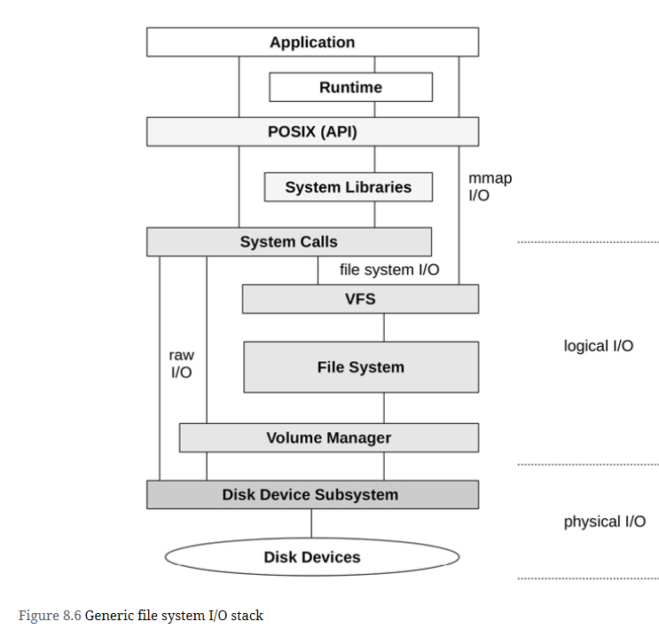

As systems become more distributed, especially with cloud computing environments, the network plays a bigger role in performance. Common tasks in network performance include improving network latency and throughput, and eliminating latency outliers, which can be caused by dropped or delayed packets.

Network analysis spans hardware and software - 
- hardware is the physical network, which includes the network interface cards, switches, routers, and gateways (these typically have software, too)
- software is the kernel network stack including network device drivers, packet queues, and packet schedulers, and the implementation of network protocols. Lower-level protocols are typically kernel software (IP, TCP, UDP, etc.) and higher-level protocols are typically library or application software (e.g., HTTP)

# Terminology
**Interface**: The term interface port refers to the physical network connector. The term interface or link refers to the logical instance of a network interface port, as seen and configured by the OS. (Not all OS interfaces are backed by hardware: some are virtual.)

**Packet**: The term packet refers to a message in a packet-switched network, such as IP packets.

**Frame**: A physical network-level message, for example an Ethernet frame.

**Socket**: An API originating from BSD for network endpoints.

**Bandwidth**: The maximum rate of data transfer for the network type, usually measured in bits per second.

**Throughput**: The current data transfer rate between the network endpoints, measured in bits per second or bytes per second.

**Latency**: Network latency can refer to the time it takes for a message to make a round-trip between endpoints, or the time required to establish a connection (e.g., TCP handshake), excluding the data transfer time that follows.

# Models
## Network Interface

Network Interface 
- is an operating system endpoint for network connections
- are mapped to physical network ports as part of their configuration. Ports connect to the network and typically have separate transmit and receive channels.

## Controller

provides one or more network ports for the system and houses a network controller: a microprocessor for transferring packets between the ports and the system I/O transport. An example controller with four ports is pictured

## Protocol Stack

# Concepts
# Networking and Routing

Host A can connect to host B via the local network, usually driven by a network switch. Host A can connect to host C via router 1, and to host D via routers 1, 2, and 3. Since network components such as routers are shared, contention from other traffic (e.g., host C to host E) can hurt performance.

Connections between pairs of hosts involve unicast transmission. Multicast transmission allows a sender to transmit to multiple destinations simultaneously, which may span multiple networks. This must be supported by the router configuration to allow delivery. In public cloud environments it may be blocked.

=======================================================================================================
# Terminology
**File system**: An organization of data as files and directories, with a file-based interface for accessing them, and file permissions to control access. Additional content may include special file types for devices, sockets, and pipes, and metadata including file access timestamps.

**File system cache**: An area of main memory (usually DRAM) used to cache file system contents, which may include different caches for various data and metadata types.

**Operations**: File system operations are requests of the file system, including read(2), write(2), open(2), close(2), stat(2), mkdir(2), and other operations.

**I/O**: Input/output. File system I/O can be defined in several ways; here it is used to mean only operations that directly read and write (performing I/O), including read(2), write(2), stat(2) (read statistics), and mkdir(2) (write a new directory entry). I/O does not include open(2) and close(2) (although those calls update metadata and can cause indirect disk I/O).

**Logical I/O**: I/O issued by the application to the file system.

**Physical I/O**: I/O issued directly to disks by the file system (or via raw I/O).

**Block size**: Also known as record size, is the size of file system on-disk data groups. See Block vs. Extent in Section 8.4.4, File System Features.

**Throughput**: The current data transfer rate between applications and the file system, measured in bytes per second.

**inode**: An index node (inode) is a data structure containing metadata for a file system object, including permissions, timestamps, and data pointers.

**VFS**: Virtual file system, a kernel interface to abstract and support different file system types.

**Volume**: An instance of storage providing more flexibility than using a whole storage device. A volume may be a portion of a device, or multiple devices.

**Volume manager**: Software for managing physical storage devices in a flexible way, creating virtual volumes for use by the OS.

# Models
## File System Interfaces

## File System Cache

## Second Level Cache

# Concepts
File system latency is the primary metric of file system performance, measured as the time from a logical file system request to its completion. It includes time spent in the file system and disk I/O subsystem, and waiting on disk devices—the physical I/O. Application threads often block during an application request in order to wait for file system requests to complete—in this way, file system latency directly and proportionally affects application performance.

Cases where applications may not be directly affected include the use of non-blocking I/O, prefetch (Section 8.3.4), and when I/O is issued from an asynchronous thread (e.g., a background flush thread)

# Architecture
## File System I/O Stack

# Methodology
## Latency Analysis
| Layer | Pros | Cons |
| :---    | :---     |  :---     |
| **Application** | Closest measure of the effect of file system latency on the application; can also inspect application context to determine if latency is occurring during the application’s primary function, or if it is asynchronous. | Technique varies between applications and application software versions. |
| **Syscall interface** | Well-documented interface. Commonly observable via operating system tools and static tracing. | Syscalls catch all file system types, including non-storage file systems (statistics, sockets), which may be confusing unless filtered. Adding to the confusion, there may also be multiple syscalls for the same file system function. For example, for read, there may be read(2), pread64(2), preadv(2), preadv2(2), etc., all of which need to be measured. |
| **VFS** | Standard interface for all file systems; one call for file system operations (e.g., vfs_write()) | VFS traces all file system types, including non-storage file systems, which may be confusing unless filtered. |
| **Top of file system** | Target file system type traced only; some file system internal context for extended details. | File system-specific; tracing technique may vary between file system software versions (although the file system may have a VFS-like interface that maps to VFS, and as such doesn’t change often). |

## Workload Characterization
Basic attributes that characterize the file system workload:
- Operation rate and operation types
- File I/O throughput
- File I/O size
- Read/write ratio
- Synchronous write ratio
- Random versus sequential file offset access

### Advanced Workload Characterization Checklist
Additional details may be included to characterize the workload. These have been listed here as questions for consideration, which may also serve as a checklist when studying file system issues thoroughly:
- What is the file system cache hit ratio? Miss rate?
- What are the file system cache capacity and current usage?
- What other caches are present (directory, inode, buffer), and what are their statistics?
- Have any attempts been made to tune the file system in the past? Are any file system parameters set to values other than their defaults?
- Which applications or users are using the file system?
- What files and directories are being accessed? Created and deleted?
- Have any errors been encountered? Was this due to invalid requests, or issues from the file system?
- Why is file system I/O issued (user-level call path)?
- To what degree do applications directly (synchronously) request file system I/O?
- What is the distribution of I/O arrival times?

## Performance Monitoring
Key metrics for file system performance are:
- Operation rate
- Operation latency

## Static Performance Tuning
Static performance tuning focuses on issues of the configured environment. For file system performance, examine the following aspects of the static configuration:
- How many file systems are mounted and actively used?
- What is the file system record size?
- Are access timestamps enabled?
- What other file system options are enabled (compression, encryption...)?
- How has the file system cache been configured? Maximum size?
- How have other caches (directory, inode, buffer) been configured?
- Is a second-level cache present and in use?
- How many storage devices are present and in use?
- What is the storage device configuration? RAID?
- Which file system types are used?
- What is the version of the file system (or kernel)?
- Are there file system bugs/patches that should be considered?
- Are there resource controls in use for file system I/O?

# Observability Tools
| Tool | Description |
| :---    | :---     |
| *mount* | List file systems and their mount flags |
| *free* | Cache capacity statistics |
| *top* | Includes memory usage summary |
| *vmstat* | Virtual memory statistics |
| *sar* | Various statistics, including historic |
| *slabtop* | Kernel slab allocator statistics |
| *strace* | System call tracing |
| *fatrace* | Trace file system operations using fanotify |
| *latencytop* | Show system-wide latency sources |
| *opensnoop* | Trace files opened |
| *filetop* | Top files in use by IOPS and bytes |
| *cachestat* | Page cache statistics |
| *ext4dist (xfs, zfs, btrfs, nfs)* | Show ext4 operation latency distribution |
| *ext4slower (xfs, zfs, btrfs, nfs)* | Show slow ext4 operations |
| *bpftrace* | Custom file system tracing |

## Other Tools
| Tool | Description |
| :---    | :---     |
| *syscount* | Counts syscalls including file system-related |
| *statsnoop* | Trace calls to stat(2) varieties |
| *syncsnoop* | Trace sync(2) and variety calls with timestamps |
| *mmapfiles* | Count mmap(2) files |
| *scread* | Count read(2) files |
| *fmapfault* | Count file map faults |
| *filelife* | Trace short-lived files with their lifespan in seconds |
| *vfsstat* | Common VFS operation statistics |
| *vfscount* | Count all VFS operations |
| *vfssize* | Show VFS read/write sizes |
| *fsrwstat* | Show VFS reads/writes by file system type |
| *fileslower* | Show slow file reads/writes |
| *filetype* | Show VFS reads/writes by file type and process |
| *ioprofile* | Count stacks on I/O to show code paths |
| *writesync* | Show regular file writes by sync flag |
| *writeback* | Show write-back events and latencies |
| *dcstat* | Directory cache hit statistics |
| *dcsnoop* | Trace directory cache lookups |
| *mountsnoop* | Trace mount and umounts system-wide |
| *icstat* | Inode cache hit statistics |
| *bufgrow* | Buffer cache growth by process and bytes |
| *readahead* | Show read ahead hits and efficiency |

# References from book reading google group
1. [Linux Performance Tuning: Dealing with Memory and Disk IO](https://www.yugabyte.com/blog/linux-performance-tuning-memory-disk-io/)
2. 
