# OS Virtualization
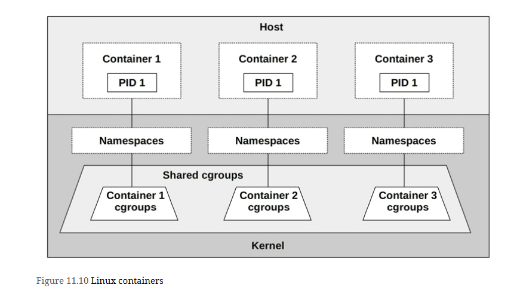

## Linux Namespaces
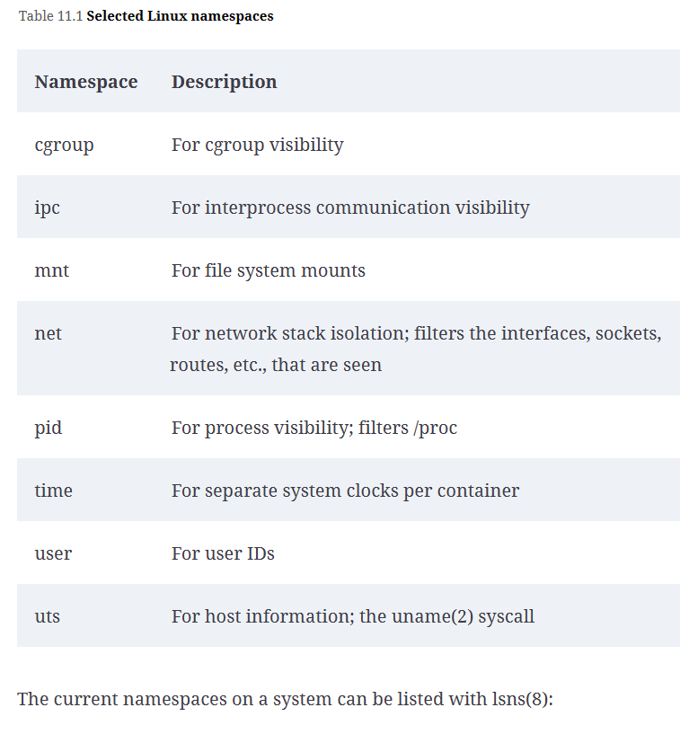

## Selected Linux cgroups
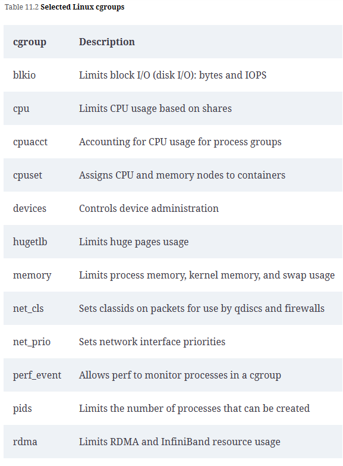

## Multi tenant contention
The presence of other running tenants is likely to cause resource contention and interrupts that hurt performance, including:

- CPU caches may have a lower hit ratio, as other tenants are consuming and evicting entries. For some processors and kernel configurations, context switching to other container threads may even flush the L1 cache. In June 2020, Linus Torvalds rejected a kernel patch that allowed processes to opt in to L1 data cache flushing [Torvalds 20b]. The patch was a security precaution for cloud environments, but was rejected due to concerns over the performance cost in cases where it was unnecessary. While not included in Linux mainline, I would not be surprised if this patch was running in some Linux distributions in the cloud.

- TLB caches may also have a lower hit ratio due to other tenant usage, and also flushing on context switches (which may be avoided if PCID is in use).

- CPU execution may be interrupted for short periods for other tenant devices (e.g., network I/O) performing interrupt service routines.

- Kernel execution can encounter additional contention for buffers, caches, queues, and locks, because a multi-tenant container system can increase their load by an order of magnitude or more. Such contention can slightly degrade application performance, depending on the kernel resource and its scalability characteristics.

- Network I/O can encounter CPU overhead due to the use of iptables to implement container networking.

- There may be contention for system resources (CPUs, disks, network interfaces) from other tenants who are using them.

## Resource Controls
Resource controls throttle access to resources so they can be shared more fairly. On Linux, these are mostly provided via cgroups.

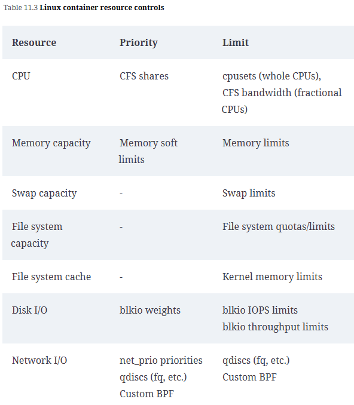

### CPUs
CPUs
CPUs can be allocated across containers using the cpusets cgroup, and shares and bandwidth from the CFS scheduler.

**cpusets**
The *cpusets* *cgroup* allows whole CPUs to be allocated to specific containers. The benefit is that those containers can run on CPU without interruption by others, and that the CPU capacity available to them is consistent. The downside is that idle CPU capacity is unavailable to other containers to use.

**Shares and Bandwidth**
CPU shares, provided by the CFS scheduler, is a different approach for CPU allocation that allows containers to share their idle CPU capacity. Shares support the concept of bursting, where a container can effectively run faster by using idle CPU from other containers. When there isn’t idle capacity, including when a host has been overprovisioned, shares provide a best-effort division of CPU resources among the containers that need them.

CPU shares work by assigning allocation units called shares to containers, which are used to calculate the amount of CPU a busy container will get at a given time. This calculation uses the formula:

container CPU = (all CPUs × container shares) / total busy shares on system

Consider a system that has allocated 100 shares between several containers. At one moment, only containers A and B want CPU resources. Container A has 10 shares, and container B has 30 shares. Container A can therefore use 25% of the total CPU resources on the system: all CPUs × 10/(10 + 30).

Now consider a system where all containers are busy at the same time. A given container’s CPU allocation will be:

container CPU = all CPUs × container shares / total shares on system

For the scenario described, container A would get 10% of the CPU capacity (CPUs × 10/100). The share allocation provides a minimum guarantee of CPU usage. Bursting may allow the container to use more. Container A can use anything from 10% to 100% of the CPU capacity, depending on how many other containers are busy.

A problem with shares is that bursting can confuse capacity planning, especially since many monitoring systems do not show bursting statistics (they should). An end user testing a container may be satisfied with its performance, unaware that this performance is only made possible by bursting. Later on, when other tenants move in, their container can no longer burst and will suffer lower performance. Imagine container A initially testing on an idle system and getting 100% CPU, but later on only getting 10% as other containers have since been added. I’ve seen this scenario happen in real life on numerous occasions, where the end user thinks that there must be a system performance issue and asks me to help debug it. They are then disappointed to learn that the system is working as intended, and that ten-times slower is the new norm because other containers have moved in. To the customer, this can feel like bait and switch.

It’s possible to reduce the problem of excessive bursting by limiting it so that the performance drop is not as severe (even though this also limits performance). On Linux this is accomplished using CFS bandwidth controls, which can set an upper limit for CPU usage. For example, container A could have bandwidth set at 20% of system-wide CPU capacity, such that with shares it now operates in the range of 10 to 20%, depending on idle availability. This range from a share-based minimum CPU to the bandwidth maximum is pictured in Figure 11.12. It assumes that there are sufficient busy threads in each container to use the available CPUs (otherwise containers become CPU-limited due to their own workloads, before hitting system-imposed limits).

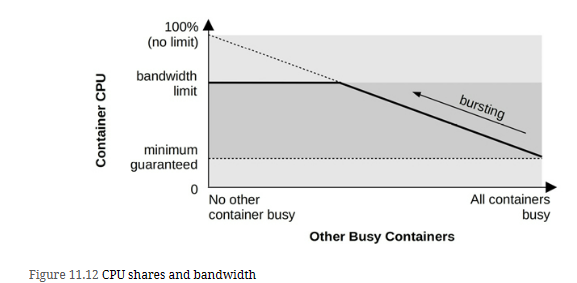

Bandwidth controls are typically exposed as a percentage of whole CPUs: 2.5 would mean two and a half CPUs. This maps to the kernel settings, which are actually periods and quotas in microseconds: a container gets a quota of CPU microseconds every period.

A different way to manage bursting is for container operators to notify their end users when they are bursting for some period of time (e.g., days) so that they do not develop wrong expectations about performance. End users can then be encouraged to upgrade their container size so that they get more shares, and a higher minimum guarantee of CPU allocation.

### Memory Capacity
The memory cgroup provides four mechanisms to manage memory usage

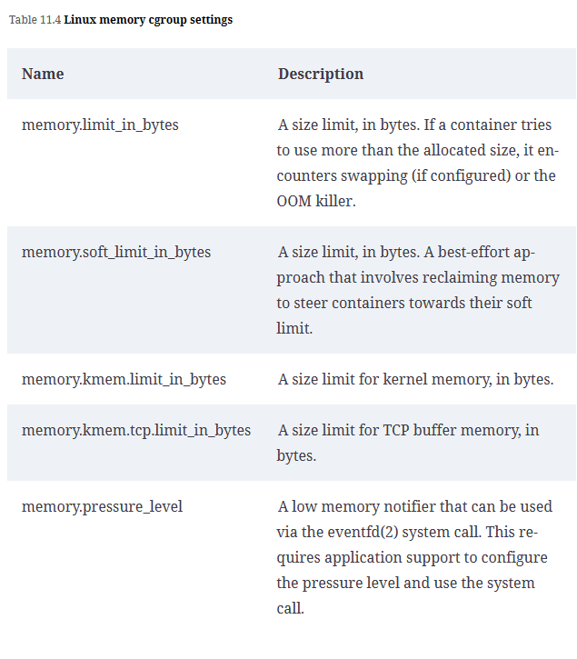

## Disk I/O
The blkio cgroup provides mechanisms to manage disk I/O. Linux *blkio cgroup* settings
| Name | Description |
| :---    | :---     |
| **blkio.weight** | A cgroup weight that controls the share of disk resources during load, similar to CPU shares. It is used with the BFQ I/O scheduler. |
| **blkio.weight_device** | A weight setting for a specific device. |
| **blkio.throttle.read_bps_device** | A limit for read bytes/s. |
| **blkio.throttle.write_bps_device** | A limit for write bytes/s. |
| **blkio.throttle.read_iops_device** | A limit for read IOPS. |
| **blkio.throttle.write_iops_device** | A limit for write IOPS. |

# Linux Traditional Tools
| Tool | From the host | From the container |
| :---    | :---     | :---     |
| **top** | The summary heading shows the host; the process table shows all host and container processes |The summary heading shows mixed statistics; some are from the host and some from the container. The process table shows container processes |
| **ps** | Shows all processes |Shows container processes |
| **uptime** | Shows host (system-wide) load averages | Shows host load averages |
| **mpstat** | Shows host CPUs and host usage | Shows host CPUs, and host CPU usage |
| **vmstat** | Shows host CPUs, memory, and other statistics | Shows host CPUs, memory, and other statistics |
| **pidstat** | Shows all processes |Shows container processes |
| **free** | Shows host memory | Shows host memory |
| **iostat** | Shows host disks | Shows host disks |
| **pidstat -d** | Shows all process disk I/O | Shows container process disk I/O |
| **sar -n DEV, TCP 1** | Shows host network interfaces and TCP statistics | Shows container network interfaces and TCP statistics |
| **perf** | Can profile everything | Either fails to run, or can be enabled and then can profile other tenants |
| **tcpdump** | Can sniff all interfaces | Only sniffs container interfaces |
| **dmesg** | Shows the kernel log | Fails to run |

# Container Tools
## K8 top nodes and pods
``` bash
# The CPU(cores) time shows cumulative milliseconds of CPU time, and CPU% shows the current usage of the node.
kubectl top nodes 

# shows the cumulative CPU time and current memory size
kubectl top pods 
```

## CGroup Statistics
``` bash
# cd /sys/fs/cgroup/cpu,cpuacct/docker/02a7cf65f82e3f3e75283944caa4462e82f...
# cat cpuacct.usage
1615816262506

# cat cpu.stat
nr_periods 507
nr_throttled 74
throttled_time 3816445175
```
The **cpuacct.usage** file shows the CPU usage of this cgroup in total nanoseconds. The **cpu.stat** file shows the number of times this cgroup was CPU throttled (**nr_throttled**), as well as the total throttled time in nanoseconds. This example shows that this cgroup was CPU throttled 74 times out of 507 time periods, for a total of 3.8 throttled seconds.

``` bash
# cd /sys/fs/cgroup/cpu,cpuacct/kubepods/burstable/pod82e745...
# cat cpuacct.usage_percpu
37944772821 35729154566 35996200949 36443793055 36517861942 36156377488 36176348313
35874604278 37378190414 35464528409 35291309575 35829280628 36105557113 36538524246
36077297144 35976388595
```
The output includes 16 fields for this 16-CPU system, with total CPU time in nanoseconds. These cgroupv1 metrics are documented in the kernel source under Documentation */cgroup-v1/cpuacct.txt*.

Command-line tools that read these statistics include **htop(1)** and **systemd-cgtop(1)**.

## Resource Controls
The resource controls listed in Section 11.3.3, Resource Controls, must be observed to identify whether a container is limited by them. Traditional performance tools and documentation focus on physical resources, and are blind to these software-imposed limits.

Flowchart for the process of determining if and how container CPUs are throttled

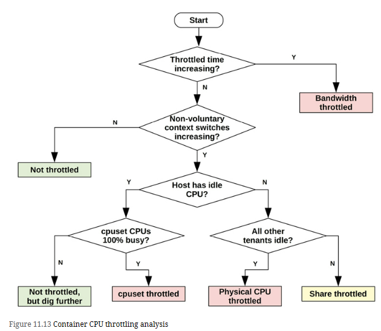

Above process determines if and how a container CPUs are throttled using five statistics:

1. **Throttled time**: cpu cgroup throttled_time
2. **Non-voluntary context switches**: Can be read from */proc/PID/status* as an increase in *nonvoluntary_ctxt_switches*
3. **Host has idle CPU**: Can be read from *mpstat(1)* %idle, */proc/stat*, and other tools
4. **cpuset CPUs 100% busy**: If cpusets are in use, their utilization can be read from *mpstat(1)*, */proc/stat*, etc.
5. **All other tenants idle**: Can be determined from a container-specific tool (docker stat), or system tools that show the lack of competition for CPU resources (e.g., if top(1) only shows the one container consuming %CPU)

similar process can be developed for other resources, and supporting statistics including the cgroup statistics should be made available in monitoring software and tools. An ideal monitoring product or tool makes the determination for you, and reports if and how each container is throttled.

## Strategy
Comments and strategies for checking each resource control:
1. CPU: See the Figure 11.13 flowchart. The use of *cpusets*, bandwidth, and shares all need to be checked.
2. Memory: For main memory, check current usage against any memory cgroup limits.
3. File system capacity: This should be observable as for any other file system (including using df(1)).
4. Disk I/O: Check the configuration of blkio cgroup throttles (*/sys/fs/cgroup/blkio*) and statistics from *blkio.throttle.io_serviced* and *blkio.throttle.io_service_bytes* files: if they are incrementing at the same rate as the throttles, it is evidence that disk I/O is throttle-limited. If BPF tracing is available, the *blkthrot(8)* tool can also be used to confirm blkio throttling [Gregg 19].
5. Network I/O: Check current network throughput against any known bandwidth limit, which may be observable only from the host. Encountering the limit causes network I/O latency to increase, as tenants are throttled.
+++++++++++++++++++++++++++++++++++++++++++++++++++++++++++++++++++++++++++++++++++++++++++++


Disk I/O can cause significant application latency, and is therefore an important target of systems performance analysis. Under high load, disks become a bottleneck, leaving CPUs idle as the system waits for disk I/O to complete. Identifying and eliminating these bottlenecks can improve performance and application throughput by orders of magnitude.

The term disks refers to the primary storage devices of the system. They include flash-memory-based solid-state disks (SSDs) and magnetic rotating disks. SSDs were introduced primarily to improve disk I/O performance, which they do. However, demands for capacity, I/O rates, and throughput are also increasing, and flash memory devices are not immune to performance issues

# Terminology
**Virtual disk**: An emulation of a storage device. It appears to the system as a single physical disk, but it may be constructed from multiple disks or a fraction of a disk.

**Transport**: The physical bus used for communication, including data transfers (I/O) and other disk commands.

**Sector**: A block of storage on disk, traditionally 512 bytes in size, but today often 4 Kbytes.

**I/O**: Strictly speaking, I/O includes only disk reads and writes, and would not include other disk commands. I/O can be described by, at least, the direction (read or write), a disk address (location), and a size (bytes).

**Disk commands**: Disks may be commanded to perform other non-data-transfer commands (e.g., a cache flush).

**Throughput**: With disks, throughput commonly refers to the current data transfer rate, measured in bytes per second.

**Bandwidth**: This is the maximum possible data transfer rate for storage transports or controllers; it is limited by hardware.

**I/O latency**: Time for an I/O operation from start to end. Within below sections, Measuring Time, defines more precise time terminology. Be aware that networking uses the term latency to refer to the time needed to initiate an I/O, followed by data transfer time.

**Latency outliers**: Disk I/O with unusually high latency.

# Models

=======================================================================================================
# Terminology
**File system**: An organization of data as files and directories, with a file-based interface for accessing them, and file permissions to control access. Additional content may include special file types for devices, sockets, and pipes, and metadata including file access timestamps.

**File system cache**: An area of main memory (usually DRAM) used to cache file system contents, which may include different caches for various data and metadata types.

**Operations**: File system operations are requests of the file system, including read(2), write(2), open(2), close(2), stat(2), mkdir(2), and other operations.

**I/O**: Input/output. File system I/O can be defined in several ways; here it is used to mean only operations that directly read and write (performing I/O), including read(2), write(2), stat(2) (read statistics), and mkdir(2) (write a new directory entry). I/O does not include open(2) and close(2) (although those calls update metadata and can cause indirect disk I/O).

**Logical I/O**: I/O issued by the application to the file system.

**Physical I/O**: I/O issued directly to disks by the file system (or via raw I/O).

**Block size**: Also known as record size, is the size of file system on-disk data groups. See Block vs. Extent in Section 8.4.4, File System Features.

**Throughput**: The current data transfer rate between applications and the file system, measured in bytes per second.

**inode**: An index node (inode) is a data structure containing metadata for a file system object, including permissions, timestamps, and data pointers.

**VFS**: Virtual file system, a kernel interface to abstract and support different file system types.

**Volume**: An instance of storage providing more flexibility than using a whole storage device. A volume may be a portion of a device, or multiple devices.

**Volume manager**: Software for managing physical storage devices in a flexible way, creating virtual volumes for use by the OS.

# Models
## File System Interfaces
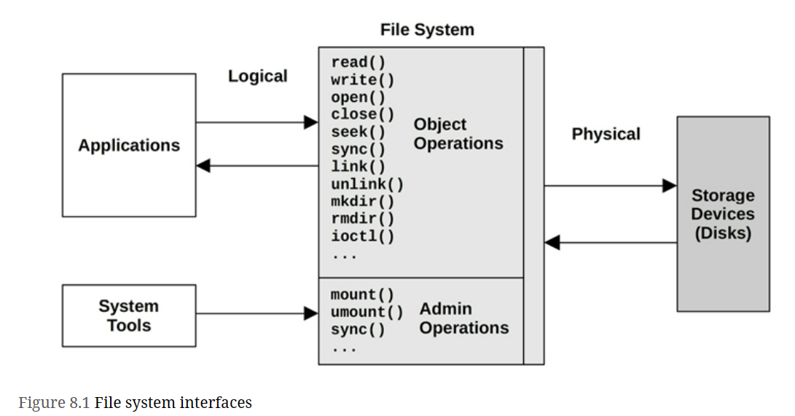

## File System Cache
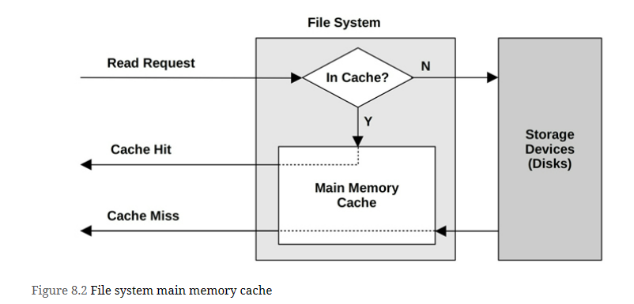

## Second Level Cache
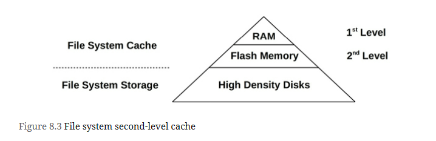

# Concepts
File system latency is the primary metric of file system performance, measured as the time from a logical file system request to its completion. It includes time spent in the file system and disk I/O subsystem, and waiting on disk devices—the physical I/O. Application threads often block during an application request in order to wait for file system requests to complete—in this way, file system latency directly and proportionally affects application performance.

Cases where applications may not be directly affected include the use of non-blocking I/O, prefetch (Section 8.3.4), and when I/O is issued from an asynchronous thread (e.g., a background flush thread)

# Architecture
## File System I/O Stack
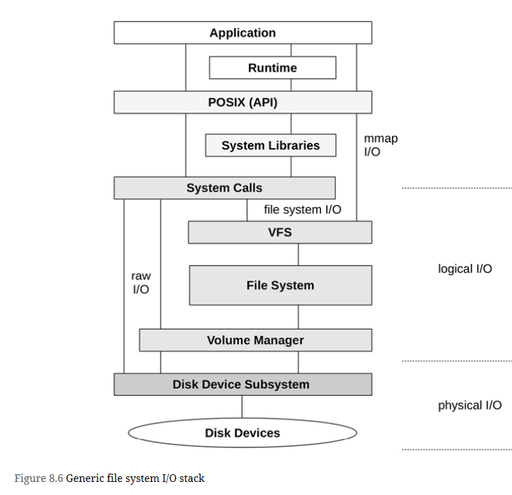

# Methodology
## Latency Analysis
| Layer | Pros | Cons |
| :---    | :---     |  :---     |
| **Application** | Closest measure of the effect of file system latency on the application; can also inspect application context to determine if latency is occurring during the application’s primary function, or if it is asynchronous. | Technique varies between applications and application software versions. |
| **Syscall interface** | Well-documented interface. Commonly observable via operating system tools and static tracing. | Syscalls catch all file system types, including non-storage file systems (statistics, sockets), which may be confusing unless filtered. Adding to the confusion, there may also be multiple syscalls for the same file system function. For example, for read, there may be read(2), pread64(2), preadv(2), preadv2(2), etc., all of which need to be measured. |
| **VFS** | Standard interface for all file systems; one call for file system operations (e.g., vfs_write()) | VFS traces all file system types, including non-storage file systems, which may be confusing unless filtered. |
| **Top of file system** | Target file system type traced only; some file system internal context for extended details. | File system-specific; tracing technique may vary between file system software versions (although the file system may have a VFS-like interface that maps to VFS, and as such doesn’t change often). |

## Workload Characterization
Basic attributes that characterize the file system workload:
- Operation rate and operation types
- File I/O throughput
- File I/O size
- Read/write ratio
- Synchronous write ratio
- Random versus sequential file offset access

### Advanced Workload Characterization Checklist
Additional details may be included to characterize the workload. These have been listed here as questions for consideration, which may also serve as a checklist when studying file system issues thoroughly:
- What is the file system cache hit ratio? Miss rate?
- What are the file system cache capacity and current usage?
- What other caches are present (directory, inode, buffer), and what are their statistics?
- Have any attempts been made to tune the file system in the past? Are any file system parameters set to values other than their defaults?
- Which applications or users are using the file system?
- What files and directories are being accessed? Created and deleted?
- Have any errors been encountered? Was this due to invalid requests, or issues from the file system?
- Why is file system I/O issued (user-level call path)?
- To what degree do applications directly (synchronously) request file system I/O?
- What is the distribution of I/O arrival times?

## Performance Monitoring
Key metrics for file system performance are:
- Operation rate
- Operation latency

## Static Performance Tuning
Static performance tuning focuses on issues of the configured environment. For file system performance, examine the following aspects of the static configuration:
- How many file systems are mounted and actively used?
- What is the file system record size?
- Are access timestamps enabled?
- What other file system options are enabled (compression, encryption...)?
- How has the file system cache been configured? Maximum size?
- How have other caches (directory, inode, buffer) been configured?
- Is a second-level cache present and in use?
- How many storage devices are present and in use?
- What is the storage device configuration? RAID?
- Which file system types are used?
- What is the version of the file system (or kernel)?
- Are there file system bugs/patches that should be considered?
- Are there resource controls in use for file system I/O?

# Observability Tools
| Tool | Description |
| :---    | :---     |
| *mount* | List file systems and their mount flags |
| *free* | Cache capacity statistics |
| *top* | Includes memory usage summary |
| *vmstat* | Virtual memory statistics |
| *sar* | Various statistics, including historic |
| *slabtop* | Kernel slab allocator statistics |
| *strace* | System call tracing |
| *fatrace* | Trace file system operations using fanotify |
| *latencytop* | Show system-wide latency sources |
| *opensnoop* | Trace files opened |
| *filetop* | Top files in use by IOPS and bytes |
| *cachestat* | Page cache statistics |
| *ext4dist (xfs, zfs, btrfs, nfs)* | Show ext4 operation latency distribution |
| *ext4slower (xfs, zfs, btrfs, nfs)* | Show slow ext4 operations |
| *bpftrace* | Custom file system tracing |

## Other Tools
| Tool | Description |
| :---    | :---     |
| *syscount* | Counts syscalls including file system-related |
| *statsnoop* | Trace calls to stat(2) varieties |
| *syncsnoop* | Trace sync(2) and variety calls with timestamps |
| *mmapfiles* | Count mmap(2) files |
| *scread* | Count read(2) files |
| *fmapfault* | Count file map faults |
| *filelife* | Trace short-lived files with their lifespan in seconds |
| *vfsstat* | Common VFS operation statistics |
| *vfscount* | Count all VFS operations |
| *vfssize* | Show VFS read/write sizes |
| *fsrwstat* | Show VFS reads/writes by file system type |
| *fileslower* | Show slow file reads/writes |
| *filetype* | Show VFS reads/writes by file type and process |
| *ioprofile* | Count stacks on I/O to show code paths |
| *writesync* | Show regular file writes by sync flag |
| *writeback* | Show write-back events and latencies |
| *dcstat* | Directory cache hit statistics |
| *dcsnoop* | Trace directory cache lookups |
| *mountsnoop* | Trace mount and umounts system-wide |
| *icstat* | Inode cache hit statistics |
| *bufgrow* | Buffer cache growth by process and bytes |
| *readahead* | Show read ahead hits and efficiency |

# References from book reading google group
1. [Linux Performance Tuning: Dealing with Memory and Disk IO](https://www.yugabyte.com/blog/linux-performance-tuning-memory-disk-io/)
2. 
