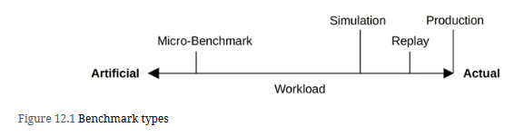

# Benchmarking Types

## Micro Benchmarking
Micro-benchmark tools mentioned in previous chapters include, by resource type:
1. CPU: SysBench
2. Memory I/O: lmbench (in Chapter 6, CPUs)
3. File system: fio
4. Disk: hdparm, dd or fio with direct I/O
5. Network: iperf

# SPEC (Standard Performance Evaluation Corporation) develops and publishes a standardized set of industry benchmarks, including:
1. [SPEC Cloud IaaS 2018](https://www.spec.org/cloud_iaas2018/results/) : This tests provisioning, compute, storage, and network resources, using multiple multi-instance workloads.
2. [SPEC CPU 2017](https://www.spec.org/cpu2017/) : A measure of compute-intensive workloads, including integer and floating point performance, and an optional metric for energy consumption.
3. [SPECjEnterprise 2018 Web Profile](https://www.spec.org/jEnterprise2018web/docs/UsersGuide.html): A measure of full-system performance for Java Enterprise Edition (Java EE) Web Profile version 7 or later application servers, databases, and supporting infrastructure.
4. [SPECsfs2014](https://www.spec.org/sfs2014/): A simulation of a client file access workload for NFS servers, common internet file system (CIFS) servers, and similar file systems.
5. [SPECvirt_sc2013](https://www.spec.org/virt_sc2013/): For virtualized environments, this measures the end-to-end performance of the virtualized hardware, the platform, and the guest operating system and application software.

# References from book reading google group
1. 
