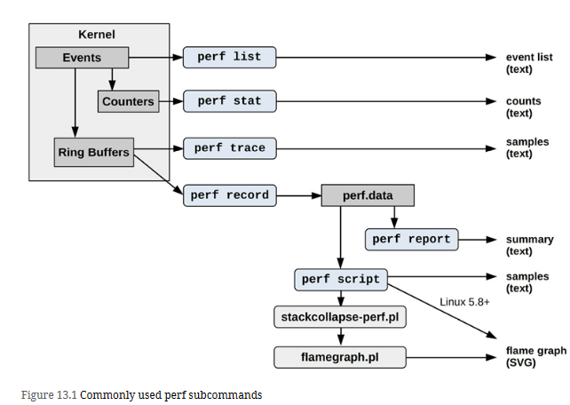

# Introduction
**_perf(1)_** is the official Linux profiler and is in the Linux kernel source under tools/perf.1 It is a multi-tool that has profiling, tracing, and scripting capabilities, and is the front-end to the kernel **perf_events** observability subsystem. perf_events is also known as Performance Counters for Linux (PCL) or Linux Performance Events (LPE).

Compared with other tracers, **perf(1)** is especially suited for **CPU analysis**: profiling (sampling) **CPU stack traces**, tracing **CPU scheduler** behavior, and examining PMCs to understand micro-architectural level CPU performance including cycle behavior. Its tracing capabilities allow it to analyze other targets as well, including disk I/O and software functions.

**_perf(1)_** can be used to answer questions such as:
1. Which code paths are consuming CPU resources?
2. Are the CPUs stalled on memory loads/stores?
3. For what reasons are threads leaving the CPU?
4. What is the pattern of disk I/O?

# Commonly used Sub Commands

