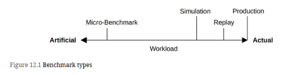

# Benchmarking Types

# Introduction
**_perf(1)_** is the official Linux profiler and is in the Linux kernel source under tools/perf.1 It is a multi-tool that has profiling, tracing, and scripting capabilities, and is the front-end to the kernel **perf_events** observability subsystem. perf_events is also known as Performance Counters for Linux (PCL) or Linux Performance Events (LPE).

Compared with other tracers, **perf(1)** is especially suited for **CPU analysis**: profiling (sampling) **CPU stack traces**, tracing **CPU scheduler** behavior, and examining PMCs to understand micro-architectural level CPU performance including cycle behavior. Its tracing capabilities allow it to analyze other targets as well, including disk I/O and software functions.

**_perf(1)_** can be used to answer questions such as:
1. Which code paths are consuming CPU resources?
2. Are the CPUs stalled on memory loads/stores?
3. For what reasons are threads leaving the CPU?
4. What is the pattern of disk I/O?

# Commonly used Sub Commands

=============================================================

# SPEC (Standard Performance Evaluation Corporation) develops and publishes a standardized set of industry benchmarks, including:
1. [SPEC Cloud IaaS 2018](https://www.spec.org/cloud_iaas2018/results/) : This tests provisioning, compute, storage, and network resources, using multiple multi-instance workloads.
2. [SPEC CPU 2017](https://www.spec.org/cpu2017/) : A measure of compute-intensive workloads, including integer and floating point performance, and an optional metric for energy consumption.
3. [SPECjEnterprise 2018 Web Profile](https://www.spec.org/jEnterprise2018web/docs/UsersGuide.html): A measure of full-system performance for Java Enterprise Edition (Java EE) Web Profile version 7 or later application servers, databases, and supporting infrastructure.
4. [SPECsfs2014](https://www.spec.org/sfs2014/): A simulation of a client file access workload for NFS servers, common internet file system (CIFS) servers, and similar file systems.
5. [SPECvirt_sc2013](https://www.spec.org/virt_sc2013/): For virtualized environments, this measures the end-to-end performance of the virtualized hardware, the platform, and the guest operating system and application software.

# References from book reading google group
1. [Beware with System.nanoTime](https://shipilev.net/blog/2014/nanotrusting-nanotime/)
2. [JMH Samples](https://github.com/openjdk/jmh/tree/master/jmh-samples/src/main/java/org/openjdk/jmh/samples)
