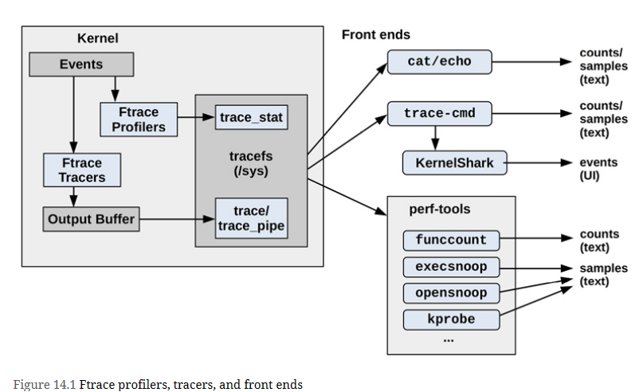
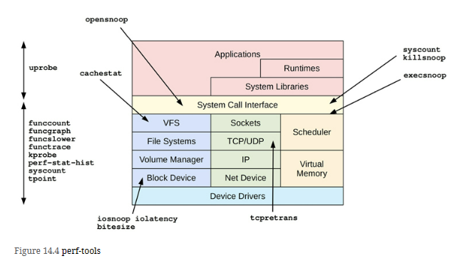

# Ftrace profilers, tracers, and front ends
Overview of Ftrace and its front ends, with arrows showing the path from events to output types

# Different perf-tools
Various perf-tools and areas of a system they can observe

Many are single-purpose tools shown with a single arrow head; some are multi-purpose tools listed on the left with a double arrow to show their coverage.

## Single Purpose perf-tools
| Tool | Uses | Description |
| :---    | :---     | :---     |
| **bitesize(8)** | perf  | Summarize disk I/O size as a histogram |
| **cachestat(8)** | Ftrace | Show page cache hit/miss statistics |
| **execsnoop(8)** | Ftrace | Trace new processes (via execve(2)) with arguments |
| **iolatency(8)** | Ftrace | Summarize disk I/O latency as a histogram |
| **iosnoop(8)** | Ftrace | Trace disk I/O with details including latency |
| **killsnoop(8)** | Ftrace | Trace kill(2) signals showing process and signal details | 
| **opensnoop(8)** | Ftrace | Trace open(2)-family syscalls showing filenames |
| **tcpretrans(8)** | Ftrace | Trace TCP retransmits, showing addresses and kernel state |

## Multi Purpose perf-tools
| Tool | Uses | Description |
| :---    | :---     | :---     |
| **funccount(8)** | perf  | Count kernel function calls |
| **funcgraph(8)** | Ftrace | Trace kernel functions showing child function code flow |
| **functrace(8)** | Ftrace | Trace kernel functions |
| **funcslower(8)** | Ftrace | Trace kernel functions slower than a threshold |
| **kprobe(8)** | Ftrace | Dynamic tracing of kernel functions |
| **perf-stat-hist(8)** | perf(1) | Custom power-of aggregations for tracepoint arguments | 
| **syscount(8)** | perf(1) | Summarize syscalls |
| **tpoint(8)** | Ftrace | Trace tracepoints |
| **uprobe(8)** | Ftrace | Dynamic tracing of user-level functions |

# References from book reading google group
1. [Brendan Gregg - Give me 15 minutes and I'll change your view of Linux tracing](https://youtu.be/GsMs3n8CB6g?si=wHF154GJjq6Ir3FA)
2. [A complete ftrace- and uprobes-based tracer (user, libraries, kernel) for GNU/Linux](https://github.com/andreoli/fulltrace)
3. [Ftrace Doc](https://www.kernel.org/doc/html/latest/trace/ftrace.html)
4. [kprobe trace Doc](https://www.kernel.org/doc/html/latest/trace/kprobetrace.html)
5. [uprobe tracer Doc](https://www.kernel.org/doc/html/latest/trace/uprobetracer.html)
6. [Events Doc](https://www.kernel.org/doc/html/latest/trace/events.html)
7. [Histogram Doc](https://www.kernel.org/doc/html/latest/trace/histogram.html)
8. Resource for frontends
   1. [trace-cmd](https://trace-cmd.org)
   2. perf ftrace: In the Linux source: tools/perf/Documentation/perf-ftrace.txt
   3. [perf-tools](https://github.com/brendangregg/perf-tools)
