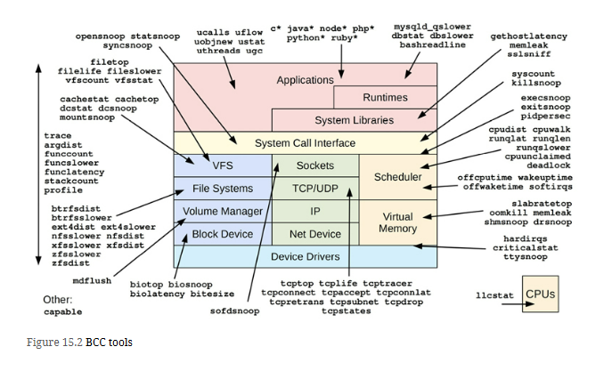
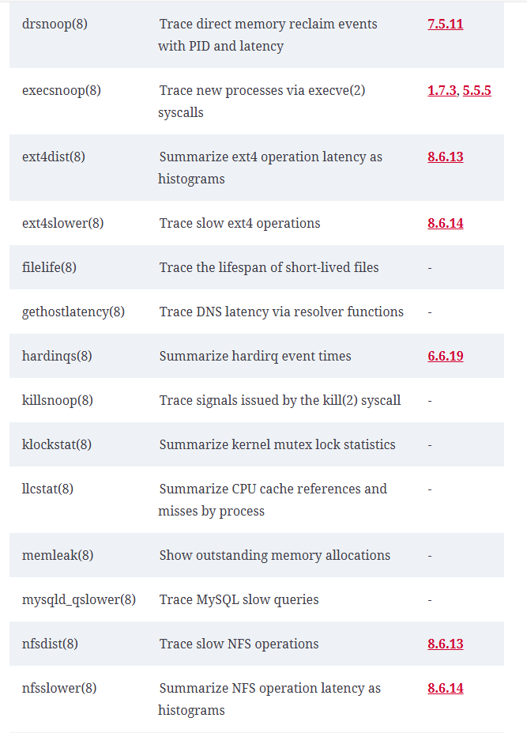
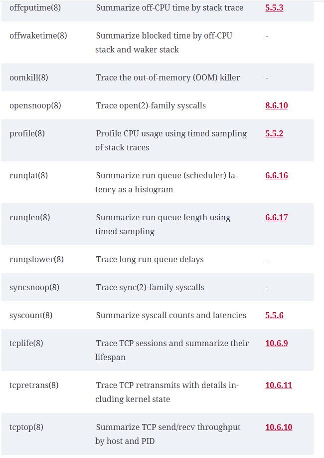
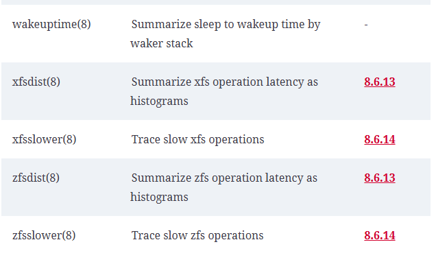
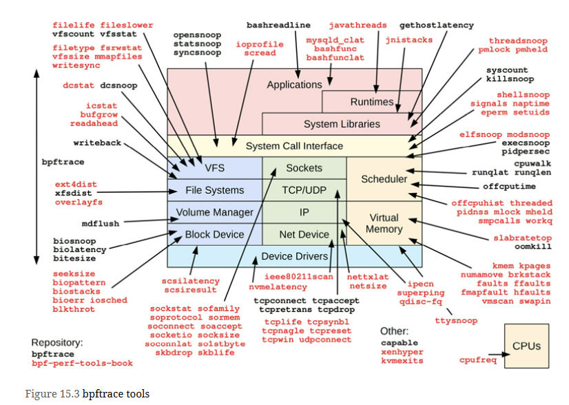

Extended BPF tools can be used to answer questions such as:
- What is the latency of disk I/O, as a histogram?
- Is CPU scheduler latency high enough to cause problems?
- Are applications suffering file system latency?
- What TCP sessions are occurring and with what durations?
- What code paths are blocking and for how long?

# BCC
BPF Compiler Collection (or “bcc” after the project and package names) is an open-source project containing a large collection of advanced performance analysis tools, as well as a framework for building them. BCC was created by Brenden Blanco;

[BCC Github](https://github.com/iovisor/bcc)

## Tool Coverage

### Single Purpose Tool
List of single purpose tools

### Multi Purpose perf-tools
List of multi purpose perf-tools

| Tool | Description |
| :---    | :---     |
| **argdist(8)** | Display function parameter values as a histogram or count |
| **funccount(8)** | Count kernel or user-level function calls |
| **funcslower(8)** | Trace slow kernel or user-level function calls |
| **funclatency(8)** | Summarize function latency as a histogram |
| **stackcount(8)** | Count stack traces that led to an event |
| **trace(8)** | Trace arbitrary functions with filters |

# BCC Vs BPFTrace
BCC is suited for custom and complex tools, which support a variety of arguments, or use a variety of libraries. bpftrace is well suited for one-liners or short tools that accept no arguments, or a single-integer argument.

The difference between BCC and bpftrace is like the difference between C programming and shell scripting, where BCC is like C programming (some of it is C programming) and bpftrace is like shell scripting. 

# BPF Tracing Tools

# References from book reading google group
1. [BCC Tools](https://github.com/iovisor/bcc)
2. [Brendan Gregg's - Getting Started with BPF Observability](https://youtu.be/bGAVrtb_tFs?si=xwBtWGDRr17XsFVr)
