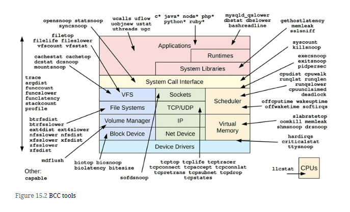
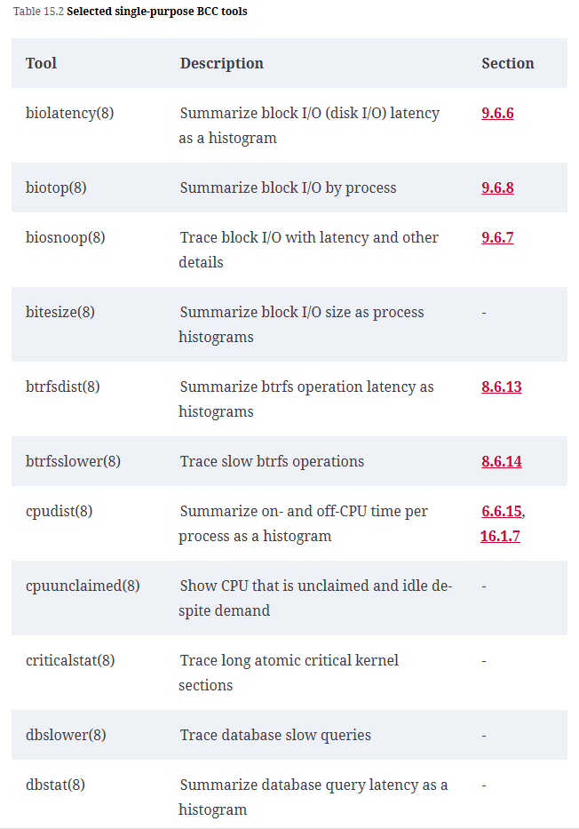
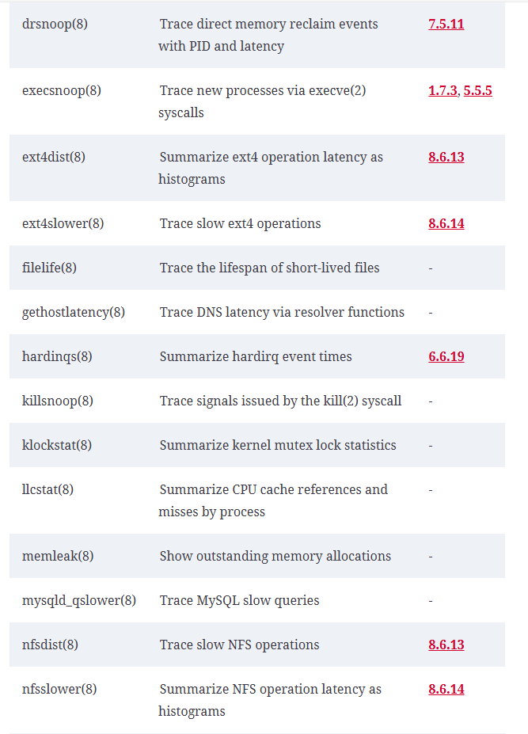
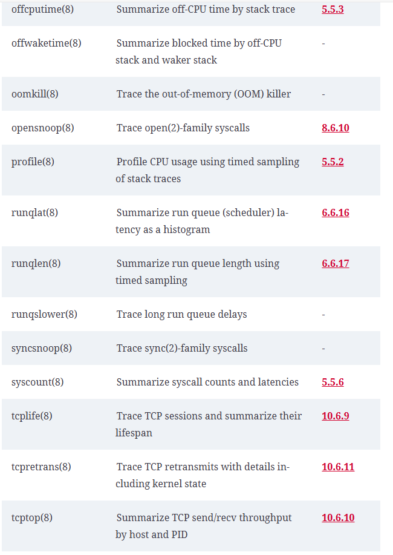
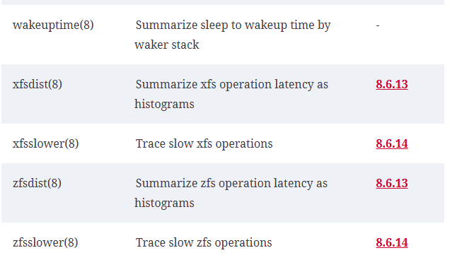
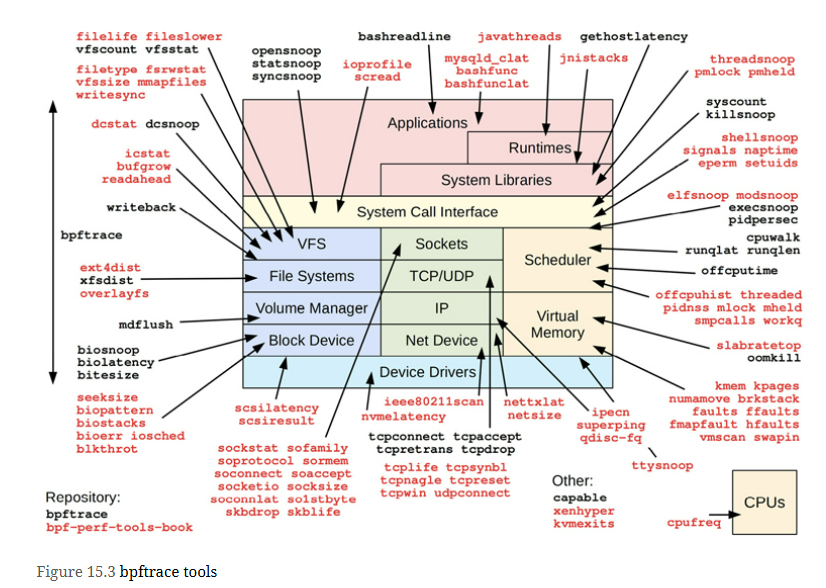

# Analysis Strategy
Gregg's methodology -
1. Start with 60-second checklist (Chapter 1, Introduction, Section 1.10.1, Linux Perf Analysis in 60s)
2. USE method - Chapter 2, Methodologies, Section 2.5.9, The USE Method
3. Drill Down Analysis - Section 2.5.12, Drill-Down Analysis

============================================================================================

[BCC Github](https://github.com/iovisor/bcc)

## Tool Coverage

### Single Purpose Tool
List of single purpose tools

### Multi Purpose perf-tools
List of multi purpose perf-tools

| Tool | Description |
| :---    | :---     |
| **argdist(8)** | Display function parameter values as a histogram or count |
| **funccount(8)** | Count kernel or user-level function calls |
| **funcslower(8)** | Trace slow kernel or user-level function calls |
| **funclatency(8)** | Summarize function latency as a histogram |
| **stackcount(8)** | Count stack traces that led to an event |
| **trace(8)** | Trace arbitrary functions with filters |

# BCC Vs BPFTrace
BCC is suited for custom and complex tools, which support a variety of arguments, or use a variety of libraries. bpftrace is well suited for one-liners or short tools that accept no arguments, or a single-integer argument.

The difference between BCC and bpftrace is like the difference between C programming and shell scripting, where BCC is like C programming (some of it is C programming) and bpftrace is like shell scripting. 

# BPF Tracing Tools

# References from book reading google group
1. [BCC Tools](https://github.com/iovisor/bcc)
2. [Brendan Gregg's - Getting Started with BPF Observability](https://youtu.be/bGAVrtb_tFs?si=xwBtWGDRr17XsFVr)
