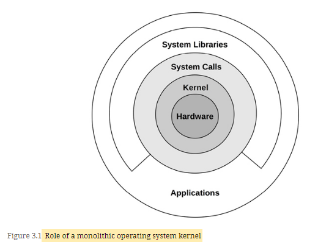

# Terminologies
- Process: An OS abstraction and environment for executing a program. The program runs in user mode, with access to kernel mode (e.g., for performing device I/O) via system calls or traps into the kernel.
- Thread: An executable context that can be scheduled to run on a CPU. The kernel has multiple threads, and a process contains one or more.
- Task: A Linux runnable entity, which can refer to a process (with a single thread), a thread from a multithreaded process, or kernel threads.
- BPF program: A kernel-mode program running in the BPF1 execution environment.
- Main memory: The physical memory of the system (e.g., RAM).
- Virtual memory: An abstraction of main memory that supports multitasking and oversubscription. It is, practically, an infinite resource.
- Kernel space: The virtual memory address space for the kernel.
- User space: The virtual memory address space for processes.
- User land: User-level programs and libraries (/usr/bin, /usr/lib...).
- Context switch: A switch from running one thread or process to another. This is a normal function of the kernel CPU scheduler, and involves switching the set of running CPU registers (the thread context) to a new set.
- Mode switch: A switch between kernel and user modes.
- System call (syscall): A well-defined protocol for user programs to request the kernel to perform privileged operations, including device I/O.
- Processor: Not to be confused with process, a processor is a physical chip containing one or more CPUs.
- Trap: A signal sent to the kernel to request a system routine (privileged action). Trap types include system calls, processor exceptions, and interrupts.
- Hardware interrupt: A signal sent by physical devices to the kernel, usually to request servicing of I/O. An interrupt is a type of trap.

# Kernel

