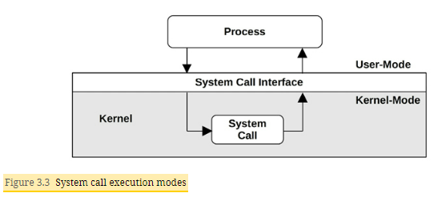
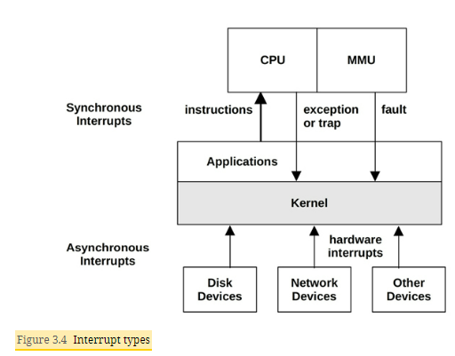
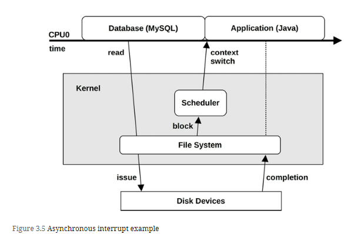
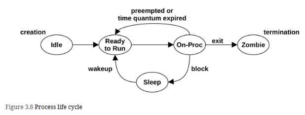
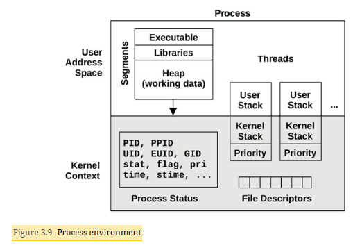
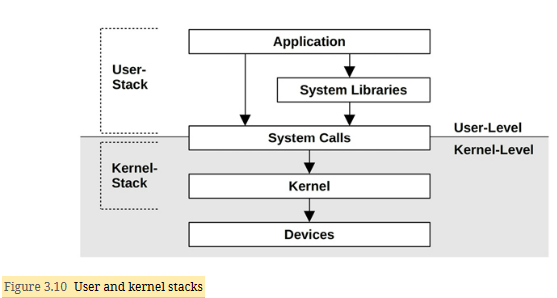
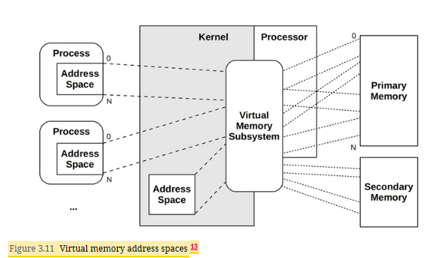
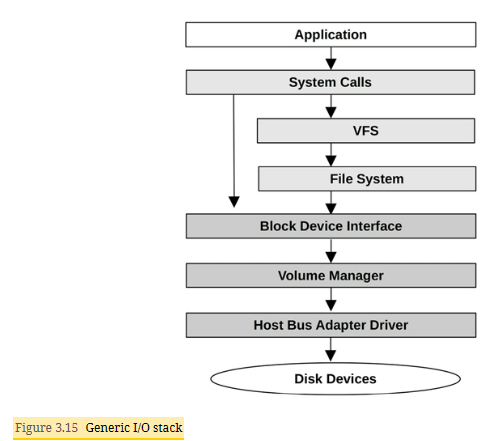

# Terminologies
- Process: An OS abstraction and environment for executing a program. The program runs in user mode, with access to kernel mode (e.g., for performing device I/O) via system calls or traps into the kernel.
- Thread: An executable context that can be scheduled to run on a CPU. The kernel has multiple threads, and a process contains one or more.
- Task: A Linux runnable entity, which can refer to a process (with a single thread), a thread from a multithreaded process, or kernel threads.
- BPF program: A kernel-mode program running in the BPF1 execution environment.
- Main memory: The physical memory of the system (e.g., RAM).
- Virtual memory: An abstraction of main memory that supports multitasking and oversubscription. It is, practically, an infinite resource.
- Kernel space: The virtual memory address space for the kernel.
- User space: The virtual memory address space for processes.
- User land: User-level programs and libraries (/usr/bin, /usr/lib...).
- Context switch: A switch from running one thread or process to another. This is a normal function of the kernel CPU scheduler, and involves switching the set of running CPU registers (the thread context) to a new set.
- Mode switch: A switch between kernel and user modes.
- System call (syscall): A well-defined protocol for user programs to request the kernel to perform privileged operations, including device I/O.
- Processor: Not to be confused with process, a processor is a physical chip containing one or more CPUs.
- Trap: A signal sent to the kernel to request a system routine (privileged action). Trap types include system calls, processor exceptions, and interrupts.
- Hardware interrupt: A signal sent by physical devices to the kernel, usually to request servicing of I/O. An interrupt is a type of trap.

# OS Kernel

System libraries are pictured here as a broken ring to show that applications can call system calls (syscalls) directly.2 For example, the Golang runtime has its own syscall layer that doesn’t require the system library, libc

## Kernel Execution
Workloads that perform **frequent I/O**, such as web servers, **execute** mostly in **kernel context**. 
Workloads that are **compute-intensive** usually **run in user mode**, uninterrupted by the kernel. It may be tempting to think that the kernel cannot affect the performance of these compute-intensive workloads, but there are many cases where it does. The most obvious is **CPU contention**, when other threads are competing for CPU resources and the kernel scheduler needs to decide which will run and which will wait. The kernel also chooses which CPU a thread will run on and can choose CPUs with warmer hardware caches or better memory locality for the process, to significantly improve performance.

### Kernel and User Modes
User programs (processes) run in user mode, where they request privileged operations from the kernel via system calls, such as for I/O.

In a traditional kernel, a system call is performed by switching to kernel mode and then executing the system call code.

Switching between user and kernel modes is a mode switch.

All system calls mode switch. Some system calls also context switch: those that are blocking, such as for disk and network I/O, will context switch so that another thread can run while the first is blocked.

### Interrupts
An interrupt is a signal to the processor that some event has occurred that needs processing, and interrupts the current execution of the processor to handle it. 
There are asynchronous interrupts generated by external hardware and synchronous interrupts generated by software instructions. 

#### Asynchronous Interrupts
Hardware devices can send interrupt service requests (IRQs) to the processor, which arrive asynchronously to the currently running software. Examples of hardware interrupts include:
- Disk devices signaling the completion of disk I/O
- Hardware indicating a failure condition
- Network interfaces signaling the arrival of a packet
- Input devices: keyboard and mouse input

Example -

To explain the concept of asynchronous interrupts, an example scenario is pictured in Figure 3.5 showing the passage of time as a database (MySQL) running on CPU 0 reads from a file system. The file system contents must be fetched from disk, so the scheduler context switches to another thread (a Java application) while the database is waiting. Sometime later, the disk I/O completes, but at this point the database is no longer running on CPU 0. The completion interrupt has occurred asynchronously to the database, showed by a dotted line

#### Synchronous Interrupts
Synchronous interrupts are generated by software instructions. The following describes different types of software interrupts using the terms traps, exceptions, and faults -
- Traps: A deliberate call into the kernel, such as by the int (interrupt) instruction. One implementation of syscalls involves calling the int instruction with a vector for a syscall handler (e.g., int 0x80 on Linux x86). int raises a software interrupt.
- Exceptions: A exceptional condition, such as by an instruction performing a divide by zero.
- Faults: A term often used for memory events, such as page faults triggered by accessing a memory location without an MMU mapping. See Chapter 7, Memory.

For these interrupts, the responsible software and instruction are still on CPU

### Processes
A process is an environment for executing a user-level program. It consists of a memory address space, file descriptors, thread stacks, and registers.

A process contains one or more threads, which operate in the process address space and share the same file descriptors. A thread is an executable context consisting of a stack, registers, and an instruction pointer (also called a program counter). Multiple threads allow a single process to execute in parallel across multiple CPUs. 

#### Process Lifecycle

The on-proc state is for running on a processor (CPU). The ready-to-run state is when the process is runnable but is waiting on a CPU run queue for its turn on a CPU. Most I/O will block, putting the process in the sleep state until the I/O completes and the process is woken up. The zombie state occurs during process termination, when the process waits until its process status has been reaped by the parent process or until it is removed by the kernel.

#### Process Environment

#### User and Kernel Stack

#### Virtual Memory

The role of virtual memory is shown in above Figure. Primary memory is main memory (RAM), and secondary memory is the storage devices (disks).

##### Memory Management
While virtual memory allows main memory to be extended using secondary storage, the kernel strives to keep the most active data in main memory. There are two kernel schemes for this:
- Process swapping moves entire processes between main memory and secondary storage.
- Paging moves small units of memory called pages (e.g., 4 Kbytes).

### I/O Stack
 the path from user-level software to the storage device is called the I/O stack. This is a subset of the entire software stack shown earlier. A generic I/O stack is shown below

