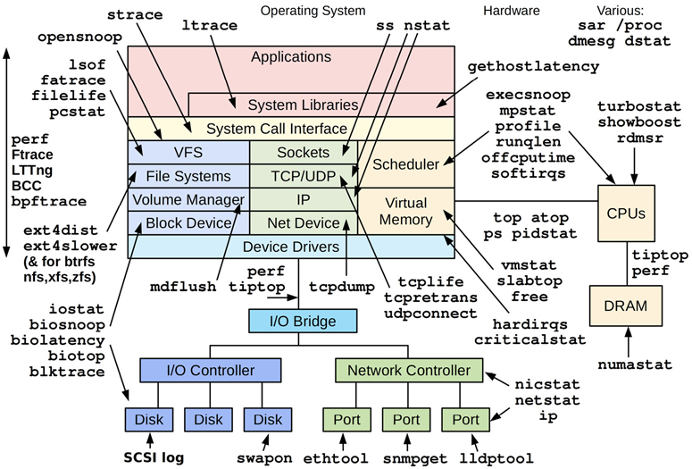
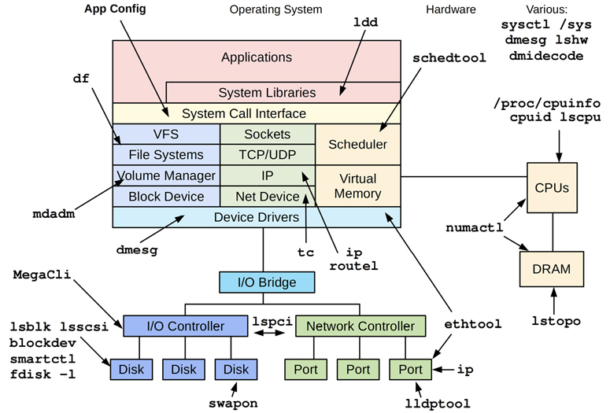
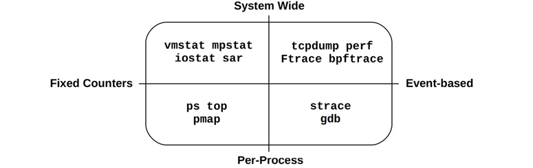
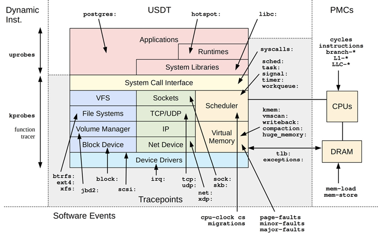

# Tool Coverage
## Linux Workload Observability Tools


## Static Performance Tools
These tools examines attributes of the system at rest rather than under active workload. They are mainly used to check for issues w.r.t configurations and components


## Crisis Tools
During production crisis above tools might not be available. Below list provides these crisis tools

| Package | Provides |
| :---    | :---     |
| `procps` | ps(1), vmstat(8), uptime(1), top(1) |
| `util-linux` | dmesg(1), lsblk(1), lscpu(1) |
| `sysstat` | iostat(1), mpstat(1), pidstat(1), sar(1) |
| `iproute2` | ip(8), ss(8), nstat(8), tc(8) |
| `numactl` | numastat(8) |
| `linux-tools-common linux-tools-$(uname -r)` | perf(1), turbostat(8) |
| `bcc-tools (aka bpfcc-tools)` | opensnoop(8), execsnoop(8), runqlat(8), runqlen(8), softirqs(8), hardirqs(8), ext4slower(8), ext4dist(8), biotop(8), biosnoop(8), biolatency(8), tcptop(8), tcplife(8), trace(8), argdist(8), funccount(8), stackcount(8), profile(8), and many more |
| `bpftrace` | bpftrace, basic versions of opensnoop(8), execsnoop(8), runqlat(8), runqlen(8), biosnoop(8), biolatency(8), and more |
| `perf-tools-unstable` | Ftrace versions of opensnoop(8), execsnoop(8), iolatency(8), iosnoop(8), bitesize(8), funccount(8), kprobe(8) |
| `trace-cmd` | trace-cmd(1) |
| `nicstat` | nicstat(1) |
| `ethtool` | ethtool(8) |
| `tiptop` | tiptop(1) |
| `msr-tools` | rdmsr(8), wrmsr(8) |
| `github.com/brendangregg/msr-cloud-tools` | showboost(8), cpuhot(8), cputemp(8) |
| `github.com/brendangregg/pmc-cloud-tools` | pmcarch(8), cpucache(8), icache(8), tlbstat(8), resstalls(8) |

In container environments, it may be desirable to create a privileged debugging container that has full access to the system2 and all tools installed. The image for this container can be installed on container hosts and deployed when needed.

# Tool Types
useful categorization for observability tools is whether they provide system-wide or per-process observability, and whether they are based on counters or events. 



## System Wide tools
These tools examine system-wide activity in the context of system software or hardware resources, using kernel counters -
- _vmstat(8)_: Virtual and physical memory statistics, system-wide 
- _mpstat(1)_: Per-CPU usage
- _iostat(1)_: Per-disk I/O usage, reported from the block device interface
- _nstat(8)_: TCP/IP stack statistics
- _sar(1)_: Various statistics; can also archive them for historical reporting

## Per Process tools
These tools are process-oriented and use counters that the kernel maintains for each process -
- _ps(1)_: Shows process status, shows various process statistics, including memory and CPU usage
- _top(1)_: Shows top processes, sorted by CPU usage or another statistic
- _pmap(1)_: Lists process memory segments with usage statistics

## Profiling
### System wide linux profilers
- _perf(1)_: The standard Linux profiler, which includes profiling subcommands
- _profile(8)_: A BPF-based CPU profiler from the BCC repository that frequency counts stack traces in kernel contex

These can also be used to target a single process

### Per process profilers
- gprof(1): The GNU profiling tool, which analyzes profiling information added by compilers (e.g., gcc -pg).
- cachegrind: A tool from the valgrind toolkit, can profile hardware cache usage (and more) and visualize profiles using kcachegrind. 
- Java Flight Recorder (JFR): Programming languages often have their own special-purpose profilers that can inspect language context. For example, JFR for Java.

## Tracing
This is similar to profiling, but the intent is to collect or inspect all events, not just a sample. __Tracing can incur higher CPU and storage overheads than profiling, which can slow the target of tracing__. This should be taken into consideration, as it may negatively affect the production workload, and measured timestamps may also be skewed by the tracer. As with profiling, tracing is typically only used as needed.

### System wide tracing tools
- tcpdump(8): Network packet tracing (uses libpcap)
- biosnoop(8): Block I/O tracing (uses BCC or bpftrace)
- execsnoop(8): New processes tracing (uses BCC or bpftrace)
- perf(1): The standard Linux profiler, can also trace events
- perf trace: A special perf subcommand that traces system calls system-wide
- Ftrace: The Linux built-in tracer
- BCC: A BPF-based tracing library and toolkit
- bpftrace: A BPF-based tracer (bpftrace(8)) and toolkit

### Per process tracing tools
- strace(1): System call tracing
- gdb(1): A source-level debugger

## Monitoring
### _sar(1)_
``` bash
# sar
Linux 4.15.0-66-generic (bgregg)  12/21/2019        _x86_64_        (8 CPU)

12:00:01 AM     CPU     %user     %nice   %system   %iowait    %steal     %idle
12:05:01 AM     all      3.34      0.00      0.95      0.04      0.00     95.66
12:10:01 AM     all      2.93      0.00      0.87      0.04      0.00     96.16
12:15:01 AM     all      3.05      0.00      1.38      0.18      0.00     95.40
12:20:01 AM     all      3.02      0.00      0.88      0.03      0.00     96.06
[...]
Average:        all      0.00      0.00      0.00      0.00      0.00      0.00
```

Monintoring software agents for linux include - 
- Performance Co-Pilot (PCP)
- Prometheus
- collectd

### Linux observability sources

| Type | Source |
| :---    | :---     |
| Per-process counters | /proc |
| System wide counters | /proc, /sys |
| Device configuration and counters | /sys |
| Cgroup statistics | /sys/fs/cgroup |
| Per-process tracing | ptrace |
| Hardware counters (PMCs) | perf_event |
| Network statistics | netlink |
| Network packet capture | libpcap |
| Per-thread latency metrics | Delay accounting |
| System-wide tracing | Function profiling (Ftrace), tracepoints, software events, kprobes, uprobes, perf_event |

### Linux tracing sources



# References from book reading google group
1. [The Suspend/Resume project from __Intel__ provides a tool for system developers to visualize the activity between suspend and resume, allowing them to identify inefficiencies and bottlenecks](https://github.com/intel/pm-graph)
2. [YT Video - Is Linux Suspend ready for the next decade - Len Brown](https://youtu.be/Pv5KvN0on0M?si=QdHcVacHYdPi3-YH)
3. [YT Video - Steven Rostedt - Learning the Linux Kernel with tracing](https://youtu.be/JRyrhsx-L5Y?si=C-F_qxOOV5_Hi28n)
4. [Linux kernel Debugging References](https://hackmd.io/@0xff07/linux-debug/%2F%400xff07%2FByPIklL_3)
5. [Getting started with _ftrace_](https://jvns.ca/blog/2017/03/19/getting-started-with-ftrace/)
6. [Command line tool to parse DTrace and perf output and display it as a flame graph inside your terminal emulator](https://github.com/4rtzel/tfg)
7. [ Terminal Flamegraph viewe](https://github.com/laixintao/flameshow)
8. [Opentelemetry - Traces](https://opentelemetry.io/docs/concepts/signals/traces/)