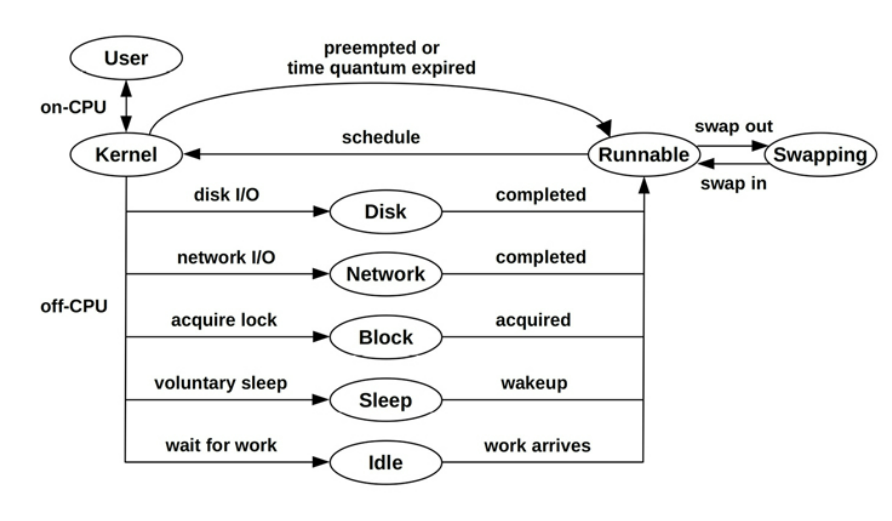

# Applications
Before diving into application performance, you should familiarize yourself with the role of the application, its basic characteristics, and its ecosystem in the industry to learn about common performance issues and tuning and provides avenues for further study. To learn this context, try answering the following questions:

1. __Function__: What is the role of the application? Is it a database server, web server, load balancer, file server, object store?
2. __Operation__: What requests does the application serve, or what operations does it perform? Databases serve queries (and commands), web servers serve HTTP requests, and so on. This can be measured as a rate, to gauge load and for capacity planning.
3. __Performance requirements__: Does the company running the application have a service level objective (SLO) (e.g., 99.9% of requests at < 100 ms latency)?
4. _CPU mode__: Is the application implemented as user-level or kernel-level software? Most applications are user-level, executing as one or more processes, but some are implemented as kernel services (for example, NFS), and BPF programs are also kernel-level.
5. __Configuration__: How is the application configured, and why? This information may be found in a configuration file or via administration tools. Check if any tunable parameters related to performance have been changed, including buffer sizes, cache sizes, parallelism (processes or threads), and other options.
6. __Host__: What hosts the application? A server or cloud instance? What are the CPUs, memory topology, storage devices, etc.? What are their limits?
7. __Metrics__: Are application metrics provided, such as an operation rate? They may be provided by bundled tools or third-party tools, via API requests, or by processing operation logs.
8. __Logs__: What operation logs does the application create? What logs can be enabled? What performance metrics, including latency, are available from the logs? For example, MySQL supports a slow query log, providing valuable performance details for each query slower than a certain threshold.
9. __Version__: Is the application the latest version? Have performance fixes or improvements been noted in the release notes for recent versions?
10. __Bugs__: Is there a bug database for the application? What are the “performance” bugs for your version of the application? If you have a current performance issue, search the bug database to see if anything like it has happened before, how it was investigated, and what else was involved.
11. __Source code__: Is the application open source? If so, code paths identified by profilers and tracers can be studied, potentially leading to performance wins. You may be able to modify the application code yourself to improve performance, and submit your improvements upstream for inclusion in the official application.
12. __Community__: Is there a community for the application where performance findings are shared? Communities may include forums, blogs, Internet Relay Chat (IRC) channels, other chat channels (e.g., Slack), meetups, and conferences. Meetups and conferences often post slides and videos online, which are useful resources for years afterward. They may also have a community manager who shares community updates and news.
13. __Books__: Are there books about the application and/or its performance? Are they good books (e.g., written by an expert, practical/actionable, makes good use of reader’s time, up to date, etc.)?
14. __Experts__: Who are the recognized performance experts for the application? Learning their names can help you find material they have authored.

## Objectives
A performance goal provides direction for your performance analysis work and helps you select which activities to perform. The goal may be:

1. __Latency__: A low or consistent application response time
2. __Throughput__: A high application operation rate or data transfer rate
3. __Resource utilization__: Efficiency for a given application workload
4. __Price__: Improving the performance/price ratio, lowering computing costs

## Big O Notation
| Notation | Examples |
| :---    | :---     |
| **O(1)** | Boolean test |
| **O(log n)** | Binary search of a sorted array |
| **O(n)** | Linear search of a linked list |
| **O(n log n)** | Quick sort (average case) |
| **O(n^2)** | Bubble sort (average case) |
| **O(2^n)** | Factoring numbers; exponential growth |
| **O(n!)** | Brute force of traveling salesman problem |

## Application Performance Techniques
### Selecting an I/O size
Costs associated with performing I/O can include initializing buffers, making a system call, mode or context switching, allocating kernel metadata, checking process privileges and limits, mapping addresses to devices, executing kernel and driver code to deliver the I/O, and, finally, freeing metadata and buffers. “Initialization tax” is paid for small and large I/O alike. For efficiency, the more data transferred by each I/O, the better.

Increasing the I/O size is a common strategy used by applications to improve throughput. It’s usually much more efficient to transfer 128 Kbytes as a single I/O than as 128 × 1 Kbyte I/O, considering any fixed per-I/O costs. Rotational disk I/O, in particular, has historically had a high per-I/O cost due to seek time.

### Caching

### Buffering
To improve write performance, data may be coalesced in a buffer before being sent to the next level. This increases the I/O size and efficiency of the operation. Depending on the type of writes, it may also increase write latency, as the first write to a buffer waits for subsequent writes before being sent

A ring buffer (or circular buffer) is a type of fixed buffer that can be used for continuous transfer between components, which act upon the buffer asynchronously.

### Polling
There are some potential performance problems with polling when there is little work to do:
- Costly CPU overhead of repeated checks
- High latency between the occurrence of the event and the next polled check

### Concurrency and Parallelism
Time-sharing systems (including all derived from Unix) provide program **concurrency**: the ability to load and begin executing multiple runnable programs. While their runtimes may overlap, they do not necessarily execute on-CPU at the same instant. Each of these programs may be an application process.

To take advantage of a multiprocessor system, an application must execute on multiple CPUs at the same time. This is **parallelism**, which an application may accomplish by using multiple processes (multiprocess) or multiple threads (multithreaded), each performing its own task.

Three common models of multithreaded programming are:

1. **Service thread pool**: A pool of threads services network requests, where each thread services one client connection at a time.
2. **CPU thread pool**: One thread is created per CPU. This is commonly used by long-duration batch processing, such as video encoding.
3. **Staged event-driven architecture (SEDA)**: Application requests are decomposed into stages that may be processed by pools of one or more threads.

#### Synchronization Primitives
Three commonly used types for applications are:

1. **Mutex (MUTually EXclusive) locks**: Only the holder of the lock can operate. Others block and wait off-CPU.
2. **Spin locks**: Spin locks allow the holder to operate, while others spin on-CPU in a tight loop, checking for the lock to be released. While these can provide low-latency access—the blocked thread never leaves CPU and is ready to run in a matter of cycles once the lock is available—they also waste CPU resources while threads spin, waiting.
3. **RW locks**: Reader/writer locks ensure integrity by allowing either multiple readers or one writer only and no readers.
4. **Semaphores**: This is a variable type that can be counting to allow a given number of parallel operations, or binary to allow only one (effectively a mutex lock).

### Garbage Collection
Disadvantage of automatic memory management -
- **Memory growth**: There is less control of the application’s memory usage, which may grow when objects are not identified automatically as eligible to be freed. If the application grows too large, it may either hit its own limits or encounter system paging (Linux swapping), severely harming performance.
- **CPU cost**: GC will typically run intermittently and involves searching or scanning objects in memory. This consumes CPU resources, reducing what is available to the application for short periods. As the memory of the application grows, CPU consumption by GC may also grow. In some cases this can reach the point where GC continually consumes an entire CPU.
- **Latency outliers**: Application execution may be paused while GC executes, causing occasional application responses with high latency that were interrupted by GC.8 This depends on the GC type: stop-the-world, incremental, or concurrent.

## Methodology
## CPU Flame graphs
In a flame graph, each rectangle is a frame from a stack trace, and the y-axis shows the code flow: top-down shows the current function and then its ancestry. The frame width is proportional to its presence in the profile, and the x-axis ordering has no meaning (it is an alphabetical sort). You look for the big “plateaus” or “towers”—that’s where the bulk of the CPU time is spent

### Off CPU footprints
browsing the CPU flame graph you may find evidence of other off-CPU issue types - file system I/O, disk I/O, network I/O, lock contention, and more. Here are some suggested search terms for Linux systems:
1. *“ext4” (or “btrfs”, “xfs”, “zfs”)*: to find file system operations.
2. *blk*: to find block I/O.
3. *tcp*: to find network I/O.
4. *utex*: to show lock contention (“mutex” or “futex”).
5. *alloc* or *object*: to show code paths doing memory allocation.

### Off CPU Analysis
Off-CPU analysis is the study of threads that are not currently running on a CPU: This state is called off-CPU. It includes all the reasons that threads block: disk I/O, network I/O, lock contention, explicit sleeps, scheduler preemption, etc.

offcputime - a BCC and bpftrace tool that summarizes time spent by thread sblocked and off-CPU, showing strack traces to explain why. 

### Syscall Analysis
System calls (syscalls) can be instrumented for the study of resource-based performance issues. The intent is to find out where syscall time is spent, including the type of syscall and the reason it is called. Syscall analysis include -

- **New Process Tracing** : By tracing the execve(2) syscall you can log new process execution, and analyze issues of short-lived processes. Tool to be utilized _execsnoop_
- **I/O Profiling** : Tracing read(2)/write(2)/send(2)/recv(2) and their variants, and studying their I/O sizes, flags, and code paths, will help you identify issues of suboptimal I/O, such as a large number of small I/O. Tool to be utilized _bpftrace_
- **Kernel Time Analysis** : When systems show a high amount of kernel CPU time, often reported as “%sys,” instrumenting syscalls can locate the cause. Tool to be utilized _syscount_ which explain most but not all of kernel CPU time; exceptions include page faults, asynchronous kernel threads, and interrupts.

### Thread State Analysis
There are 2 thread states : on-CPU and off-CPU.

List of 9 states of a thread:
- **User**: On-CPU in user mode
- **Kernel**: On-CPU in kernel mode
- **Runnable**: And off-CPU waiting for a turn on-CPU
- **Swapping** (anonymous paging): Runnable, but blocked for anonymous page-ins
- **Disk I/O**: Waiting for block device I/O: reads/writes, data/text page-ins
- **Net I/O**: Waiting for network device I/O: socket reads/writes
- **Sleeping**: A voluntary sleep
- **Lock**: Waiting to acquire a synchronization lock (waiting on someone else)
- **Idle**: Waiting for work

three approaches that I use on Linux: clue-based, off-CPU analysis, and direct measurement.
#### Clue Based
start by using common OS tools, such as pidstat(1) and vmstat(8), to suggest where thread state time may be spent. The tools and column of interest are:
- **User**: _pidstat(1) “%usr”_ (this state is measured directly)
- **Kernel**: _pidstat(1) “%system”_ (this state is measured directly)
- **Runnable**: _vmstat(8) “r”_ (system-wide)
- **Swapping**: _vmstat(8) “si” and “so”_ (system-wide)
- **Disk I/O**: _pidstat(1) -d “iodelay”_ (includes the swapping state)
- **Network I/O**: _sar(1) -n DEV “rxkB/s” and “txkB/s”_ (system-wide)
- **Sleeping**: Not easily available
- **Lock**: perf(1) top (may identify spin lock time directly)
- **Idle**: Not easily available

#### Off CPU Analysis

#### Direct Measurement
Measure thread time accurately by thread state using linux and bpf/ebpf tools

### Static Performance Testing
Static performance tuning focuses on issues of the configured environment. For application performance, examine the following aspects of the static configuration:

1. What version of the application is running, and what are its dependencies? Are there newer versions? Do their release notes mention performance improvements?
2. Are there known performance issues? Is there a bug database that lists them?
3. How is the application configured?
4. If it was configured or tuned differently from the defaults, what was the reason? (Was it based on measurements and analysis, or guesswork?)
5. Does the application employ a cache of objects? How is it sized?
6. Does the application run concurrently? How is that configured (e.g., thread pool sizing)?
7. Is the application running in a special mode? (For example, debug mode may have been enabled and be reducing performance, or the application may be a debug build instead of a release build.)
8. What system libraries does the application use? What versions are they?
9. What memory allocator does the application use?
10. Is the application configured to use large pages for its heap?
11. Is the application compiled? What version of the compiler? What compiler options and optimizations? 64-bit?
12. Does the native code include advanced instructions? (Should it?) (For example, SIMD/vector instructions including Intel SSE.)
13. Has the application encountered an error, and is it now in a degraded mode? Or is it misconfigured and always running in a degraded mode?
14. Are there system-imposed limits or resource controls for CPU, memory, file system, disk, or network usage? (These are common with cloud computing.)

Answering these questions may reveal configuration choices that have been overlooked.

# Observability Tools
| Tool | Description |
| :---    | :---     |
| *perf* | CPU profiling, CPU flame graphs, syscall tracing |
| *profile* | CPU profiling using timed sampling |
| *offcputtime* | Off-CPU profiling using scheduler tracing |
| *strace* | Syscall tracing |
| *execsnoop* | New process tracing |
| *syscall* | Syscall counting |
| *bpftrace* | Signal tracing, I/O profiling, lock analysis |

# References from book reading google group
1. [Unlocking Kafka's Potential: Tackling Tail Latency with eBPF](https://blog.allegro.tech/2024/03/kafka-performance-analysis.html)