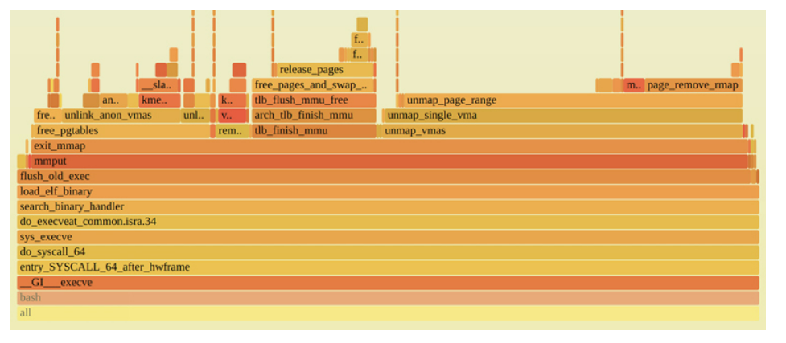
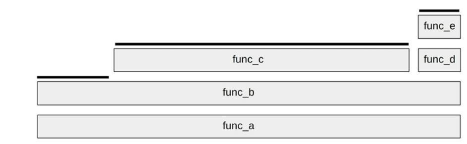

# Terminology
For reference, CPU-related terminology used in this chapter includes the following:
1. **Processor**: The physical chip that plugs into a socket on the system or processor board and contains one or more CPUs implemented as cores or hardware threads.
2. **Core**: An independent CPU instance on a multicore processor. The use of cores is a way to scale processors, called chip-level multiprocessing (CMP).
3. **Hardware thread**: A CPU architecture that supports executing multiple threads in parallel on a single core (including Intel’s Hyper-Threading Technology), where each thread is an independent CPU instance. This scaling approach is called simultaneous multithreading (SMT).
4. **CPU instruction**: A single CPU operation, from its instruction set. There are instructions for arithmetic operations, memory I/O, and control logic.
5. **Logical CPU**: Also called a virtual processor (also known as virtual CPU), an operating system CPU instance (a schedulable CPU entity). This may be implemented by the processor as a hardware thread (in which case it may also be called a virtual core), a core, or a single-core processor.
6. **Scheduler**: The kernel subsystem that assigns threads to run on CPUs. 
7. **Run queue**: A queue of runnable threads that are waiting to be serviced by CPUs. Modern kernels may use some other data structure (e.g., a red-black tree) to store runnable threads, but we still often use the term run queue

## CPU Utilization
High CPU utilization may not necessarily be a problem, but rather a sign that the system is doing work. Some people also consider this a return of investment (ROI) indicator: a highly utilized system is considered to have good ROI, whereas an idle system is considered wasted. Unlike with other resource types (disks), performance does not degrade steeply under high utilization, as the kernel supports priorities, preemption, and time sharing. These together allow the kernel to understand what has higher priority, and to ensure that it runs first.

CPU may be highly utilized because it is often stalled waiting for memory I/O, not just executing instructions, as described in the previous section. This is the case for the Netflix cloud, where the CPU utilization is mostly memory stall cycles

CPU utilization is often split into separate kernel- and user-time metrics.

### User time and kernel time
The CPU time spent executing user-level software is called user time, and kernel-level software is kernel time. Kernel time includes time during system calls, kernel threads, and interrupts. When measured across the entire system, the user time/kernel time ratio indicates the type of workload performed.

Applications that are computation-intensive may spend almost all their time executing user-level code and have a user/kernel ratio approaching 99/1. Examples include image processing, machine learning, genomics, and data analysis.

Applications that are I/O-intensive have a high rate of system calls, which execute kernel code to perform the I/O. For example, a web server performing network I/O may have a user/kernel ratio of around 70/30.

These numbers are dependent on many factors and are included to express the kinds of ratios expected.

### Saturation
A CPU at 100% utilization is saturated, and threads will encounter scheduler latency as they wait to run on-CPU, decreasing overall performance. This latency is the time spent waiting on the CPU run queue or other structure used to manage threads.

Another form of CPU saturation involves CPU resource controls, as may be imposed in a multi-tenant cloud computing environment. While the CPU may not be 100% utilized, the imposed limit has been reached, and threads that are runnable must wait their turn.

## Tools Method
For CPUs, the tools method can involve checking the following (Linux):
1. **uptime/top**: Check the load averages to see if load is increasing or decreasing over time. Bear this in mind when using the following tools, as load may be changing during your analysis.
2. **vmstat**: Run vmstat(1) with a one-second interval and check the system-wide CPU utilization (“us” + “sy”). Utilization approaching 100% increases the likelihood of scheduler latency.
3. mpstat: Examine statistics per-CPU and check for individual hot (busy) CPUs, identifying a possible thread scalability problem.
4. **top**: See which processes and users are the top CPU consumers.
5. **pidstat**: Break down the top CPU consumers into user- and system-time.
6. **perf/profile**: Profile CPU usage stack traces for both user- or kernel-time, to identify why the CPUs are in use.
7. **perf**: Measure IPC as an indicator of cycle-based inefficiencies.
8. **showboost/turboboost**: Check the current CPU clock rates, in case they are unusually low.
9. dmesg: Check for CPU temperature stall messages (“cpu clock throttled”).

## USE Method
For environments that implement CPU limits or quotas (resource controls; e.g., Linux tasksets and cgroups), as is common in cloud computing environments, CPU utilization should be measured in terms of the imposed limit, in addition to the physical limit. Your system may exhaust its CPU quota well before the physical CPUs reach 100% utilization, encountering saturation earlier than expected.

## Workload Characterization
Attributes for characterizing CPU workload are:
- CPU load averages (utilization + saturation)
- User-time to system-time ratio
- Syscall rate
- Voluntary context switch rate
- Interrupt rate

The user-time to system-time ratio shows the type of load applied, as introduced earlier in Section 6.3.9, User Time/Kernel Time. High user time rates are due to applications spending time performing their own compute. High system time shows time spent in the kernel instead, which may be further understood by the syscall and interrupt rate. I/O-bound workloads have higher system time, syscalls, and higher voluntary context switches than CPU-bound workloads as threads block waiting for I/O.

E.g for workload description -
On an average 48-CPU application server, the load average varies between 30 and 40 during the day. The user/system ratio is 95/5, as this is a CPU-intensive workload. There are around 325 K syscalls/s, and around 80 K voluntary context switches/s.

### Advanced Workload Characterizatoin / Checklist
- What is the CPU utilization system-wide? Per CPU? Per core?
- How parallel is the CPU load? Is it single-threaded? How many threads?
- Which applications or users are using the CPUs? How much?
- Which kernel threads are using the CPUs? How much?
- What is the CPU usage of interrupts?
- What is the CPU interconnect utilization?
- Why are the CPUs being used (user- and kernel-level call paths)?
- What types of stall cycles are encountered?

## Profiling
CPU profiling can be performed in different ways -
1. Timer based sampling
2. Function Tracing

### Flame graph interpretation

#### How to read
A CPU flame graph has the following characteristics:

Each box represents a function in the stack (a “stack frame”).
- The y-axis shows stack depth (number of frames on the stack). The top-most box shows the function that was on-CPU. Everything beneath that is ancestry. The function beneath a function is its parent, just as in the stack traces shown earlier.
- The x-axis spans the sample population. It does not show the passing of time from left to right, as most graphs do. The left-to-right ordering has no meaning (it’s sorted alphabetically).
- The width of the box shows the total time the function was on-CPU or part of an ancestry that was on-CPU (based on sample count). Wider box functions may be slower than narrow box functions, or they may simply be called more often. The call count is not shown (nor is it known via sampling).

#### Flame graph interpretation
To explain how to interpret a flame graph in detail, consider the simple synthetic CPU flame graph shown

The top edge has been highlighted with a line: this shows the functions that are directly running on-CPU. *func_c()* was directly on-CPU for 70% of the time, *func_b()* was on-CPU for 20% of the time, and *func_e()* was on-CPU for 10% of the time. The other functions, *func_a()* and *func_d()*, were never sampled on-CPU directly.

To read a flame graph, look for the widest towers and understand them first. As per above figure  it is the code path func_a() -> func_b() -> func_c()

For large profiles of thousands of samples, there may be code paths that were sampled only a few times, and are printed in such a narrow tower that there is no room to include the function name. This turns out to be a benefit: Your attention is naturally drawn to the wider towers that have legible function names, and looking at them helps you understand the bulk of the profile first.

Note that for recursive functions, each level is shown by a separate frame.

#### Method for finding performance wins in a CPU flame graphs is as follows:

1. Look top-down (leaf to root) for large “plateaus.” These show that a single function is on-CPU during many samples, and can lead to some quick wins. In Figure 6.16, there are two plateaus on the right, in unmap_page_range() and page_remove_rmap(), both related to memory pages. Perhaps a quick win is to switch the application to use large pages.

2. Look bottom-up to understand the code hierarchy. In this example, the bash(1) shell was calling the execve(2) syscall, which eventually called the page functions. Perhaps an even bigger win is to avoid execve(2) somehow, such as by using bash builtins instead of external processes, or switching to another language.

3. Look more carefully top-down for scattered but common CPU usage. Perhaps there are many small frames related to the same problem, such as lock contention. Inverting the merge order of flame graphs so that they are merged from leaf to root and become icicle graphs can help reveal these cases.

## Cycle Analysis
You can use Performance Monitoring Counters (PMCs) to understand CPU utilization at the cycle level. This may reveal that cycles are spent stalled on Level 1, 2, or 3 cache misses, memory or resource I/O, or spent on floating-point operations or other activity. This information may show performance wins you can achieve by adjusting compiler options or changing the code.

Begin cycle analysis by measuring IPC (inverse of CPI). If IPC is low, continue to investigate types of stall cycles. If IPC is high, look for ways in the code to reduce instructions performed. The values for “high” or “low” IPC depend on your processor: low could be less than 0.2, and high could be greater than 1. You can get a sense of these values by performing known workloads that are either memory I/O-intensive or instruction-intensive, and measuring the resulting IPC for each.

## Performance Monitoring
Key metrics for CPUs are:
- Utilization: Percent busy
- Saturation: Either run-queue length or scheduler latency

## Static Performance Tuning
Static performance tuning focuses on issues of the configured environment. For CPU performance, examine the following aspects of the static configuration:
- How many CPUs are available for use? Are they cores? Hardware threads?
- Are GPUs or other accelerators available and in use?
- Is the CPU architecture single- or multiprocessor?
- What is the size of the CPU caches? Are they shared?
- What is the CPU clock speed? Is it dynamic (e.g., Intel Turbo Boost and SpeedStep)? Are those  dynamic features enabled in the BIOS?
- What other CPU-related features are enabled or disabled in the BIOS? E.g., turboboost, bus settings, power saving settings?
- Are there performance issues (bugs) with this processor model? Are they listed in the processor errata sheet?
- What is the microcode version? Does it include performance-impacting mitigations for security vulnerabilities (e.g., Spectre/Meltdown)?
- Are there performance issues (bugs) with this BIOS firmware version?
- Are there software-imposed CPU usage limits (resource controls) present? What are they?

## Priority Tuning
Unix has always provided a nice(2) system call for adjusting process priority, which sets a nice-ness value. Positive nice values result in lower process priority (nicer), and negative values—which can be set only by the superuser (root)7—result in higher priority. A nice(1) command became available to launch programs with nice values, and a renice(1M) command was later added (in BSD) to adjust the nice value of already running processes.

The value of 16 is recommended to users who wish to execute long-running programs without flak from the administration.

## CPU Binding
Another way to tune CPU performance involves binding processes and threads to individual CPUs, or collections of CPUs. This can increase CPU cache warmth for the process, improving its memory I/O performance. For NUMA systems it also improves memory locality, further improving performance.

There are generally two ways this is performed:

- **CPU binding**: Configuring a process to run only on a single CPU, or only on one CPU from a defined set.
- **Exclusive CPU sets**: Partitioning a set of CPUs that can be used only by the process(es) assigned to them. This can further improve CPU cache warmth, as when the process is idle other processes cannot use those CPUs.

//// to be continued from 6.5.2 i.e. USE Method

# Observability Tools
| Tool | Description |
| :---    | :---     |
| *uptime* | Load Averages |
| *vmstat* | Includes system-wide CPU averages |
| *mpstat* | Per-CPU statistics |
| *sar* | Historical statistics |
| *ps* | Process status |
| *top* | Monitor per-process/thread CPU usage |
| *pidstat* | Per-process/thread CPU breakdowns |
| *time, ptime* | Time a command, with CPU breakdowns |
| *turboboost* | Show CPU clock rate and other states |
| *showboost* | Show CPU clock rate and turbo boost |
| *pmcarch* | Show high-level CPU cycle usage |
| *tlbstat* | Summarize TLB cycles |
| *perf* | CPU profiling and PMC analysis |
| *profile* | Sample CPU stack traces |
| *cpudist* | Summarize on-CPU time |
| *runqlat* | Summarize CPU run queue latency |
| *runqlen* | Summarize CPU run queue length |
| *softirqs* | Summarize soft interrupt time |
| *hardirqs* | Summarize hard interrupt time |
| *bpftrace* | Tracing programs for CPU analysis |

For each of the above tools, refer Ch6 of this book

## _*perf*_
perf(1) is the official Linux profiler, a multi-tool with many capabilitie

### One liners
Please refer this section to get exact command and the purpose it servers

# References from book reading google group
1. [Unlocking Kafka's Potential: Tackling Tail Latency with eBPF](https://blog.allegro.tech/2024/03/kafka-performance-analysis.html)
2. [Reconciling High Server Utilization and Sub-millisecond Quality-of-Service](http://csl.stanford.edu/~christos/publications/2014.mutilate.eurosys.pdf)
3. [Command _cpustat_ help](https://illumos.org/man/8/cpustat)
4. [_dtrace_](https://dtrace.org/about/)