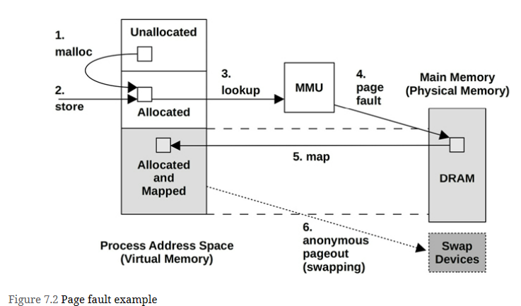

# Terminology
- **Main memory**: Also referred to as physical memory, this describes the fast data storage area of a computer, commonly provided as DRAM.

- **Virtual memory**: An abstraction of main memory that is (almost) infinite and non-contended. Virtual memory is not real memory.

- **Resident memory**: Memory that currently resides in main memory.

- **Anonymous memory**: Memory with no file system location or path name. It includes the working data of a process address space, called the heap.

- **Address space**: A memory context. There are virtual address spaces for each process, and for the kernel.

- **Segment**: An area of virtual memory flagged for a particular purpose, such as for storing executable or writeable pages.

- **Instruction text**: Refers to CPU instructions in memory, usually in a segment.

- **OOM**: Out of memory, when the kernel detects low available memory.

- **Page**: A unit of memory, as used by the OS and CPUs. Historically it is either 4 or 8 Kbytes. Modern processors have multiple page size support for larger sizes.

- **Page fault**: An invalid memory access. These are normal occurrences when using on-demand virtual memory.

- **Paging**: The transfer of pages between main memory and the storage devices.

- **Swapping**: Linux uses the term swapping to refer to anonymous paging to the swap device (the transfer of swap pages). In Unix and other operating systems, swapping is the transfer of entire processes between main memory and the swap devices. This book uses the Linux version of the term.

- **Swap**: An on-disk area for paged anonymous data. It may be an area on a storage device, also called a physical swap device, or a file system file, called a swap file. Some tools use the term swap to refer to virtual memory (which is confusing and incorrect).
  
# Concepts
## Virtual Memory
The process address space is mapped by the virtual memory subsystem to main memory and the physical swap device.

## Paging
Paging is the movement of pages in and out of main memory, which are referred to as page-ins and page-outs, respectively

## File System Paging
File system paging is caused by the reading and writing of pages in memory-mapped files. This is normal behavior for applications that use file memory mappings (mmap(2)) and on file systems that use the page cache

## Anonymous Paging
involves data that is private to processes: the process heap and stacks. It is termed anonymous because it has no named location in the operating system (i.e., no file system path name). Anonymous page-outs require moving the data to the physical swap devices or swap files.

Anonymous paging hurts performance and has therefore been referred to as “bad” paging [McDougall 06a]. When applications access memory pages that have been paged out, they block on the disk I/O required to read them back to main memory.1 This is an anonymous page-in, which introduces synchronous latency to the application. Anonymous page-outs may not affect application performance directly, as they can be performed asynchronously by the kernel.

Performance is best when there is no anonymous paging (swapping). This can be achieved by configuring applications to remain within the main memory available and by monitoring page scanning, memory utilization, and anonymous paging, to ensure that there are no indicators of a memory shortage

## Demand Paging
Operating systems that support demand paging (most do) map pages of virtual memory to physical memory on demand, as shown

The result of the virtual memory model and demand allocation is that any page of virtual memory may be in one of the following states:
1. Unallocated
2. Allocated, but unmapped (unpopulated and not yet faulted)
3. Allocated, and mapped to main memory (RAM)
4. Allocated, and mapped to the physical swap device (disk)

State (4) is reached if the page is paged out due to system memory pressure. A transition from (2) to (3) is a page fault. If it requires disk I/O, it is a major page fault; otherwise, a minor page fault.

From these states, two memory usage terms can also be defined:

- **Resident set size (RSS)**: The size of allocated main memory pages (3)
- **Virtual memory size**: The size of all allocated areas (2 + 3 + 4)

## Overcommit
Linux supports the notion of overcommit, which allows more memory to be allocated than the system can possibly store—more than physical memory and swap devices combined. It relies on demand paging and the tendency of applications to not use much of the memory they have allocated.

## Process Swapping
Process swapping is the movement of entire processes between main memory and the physical swap device or swap file.

To swap out a process, all of its private data must be written to the swap device, including the process heap (anonymous data), its open file table, and other metadata that is only needed when the process is active. Data that originated from file systems and has not been modified can be dropped and read from the original locations again when needed.

Process swapping severely hurts performance, as a process that has been swapped out requires numerous disk I/O to run again.

## Working Set Size
Working set size (WSS) is the amount of main memory a process frequently uses to perform work. **It is a useful concept for memory performance tuning: performance should greatly improve if the WSS can fit into the CPU caches, rather than main memory. Also, performance will greatly degrade if the WSS exceeds the main memory size, and the application must swap to perform work.**

# Architecture

