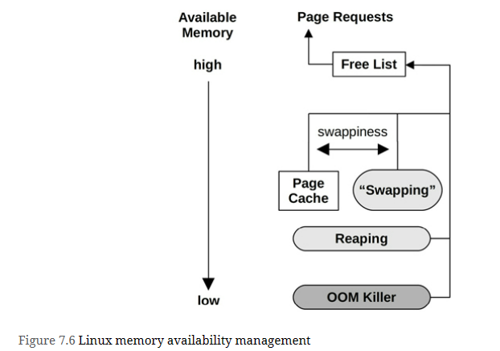

# Terminology
- **Main memory**: Also referred to as physical memory, this describes the fast data storage area of a computer, commonly provided as DRAM.

- **Virtual memory**: An abstraction of main memory that is (almost) infinite and non-contended. Virtual memory is not real memory.

- **Resident memory**: Memory that currently resides in main memory.

- **Anonymous memory**: Memory with no file system location or path name. It includes the working data of a process address space, called the heap.

- **Address space**: A memory context. There are virtual address spaces for each process, and for the kernel.

- **Segment**: An area of virtual memory flagged for a particular purpose, such as for storing executable or writeable pages.

- **Instruction text**: Refers to CPU instructions in memory, usually in a segment.

- **OOM**: Out of memory, when the kernel detects low available memory.

- **Page**: A unit of memory, as used by the OS and CPUs. Historically it is either 4 or 8 Kbytes. Modern processors have multiple page size support for larger sizes.

- **Page fault**: An invalid memory access. These are normal occurrences when using on-demand virtual memory.

- **Paging**: The transfer of pages between main memory and the storage devices.

- **Swapping**: Linux uses the term swapping to refer to anonymous paging to the swap device (the transfer of swap pages). In Unix and other operating systems, swapping is the transfer of entire processes between main memory and the swap devices. This book uses the Linux version of the term.

- **Swap**: An on-disk area for paged anonymous data. It may be an area on a storage device, also called a physical swap device, or a file system file, called a swap file. Some tools use the term swap to refer to virtual memory (which is confusing and incorrect).
  
# Concepts
## Virtual Memory
The process address space is mapped by the virtual memory subsystem to main memory and the physical swap device.

## Paging
Paging is the movement of pages in and out of main memory, which are referred to as page-ins and page-outs, respectively

## File System Paging
File system paging is caused by the reading and writing of pages in memory-mapped files. This is normal behavior for applications that use file memory mappings (mmap(2)) and on file systems that use the page cache

## Anonymous Paging
involves data that is private to processes: the process heap and stacks. It is termed anonymous because it has no named location in the operating system (i.e., no file system path name). Anonymous page-outs require moving the data to the physical swap devices or swap files.

Anonymous paging hurts performance and has therefore been referred to as “bad” paging [McDougall 06a]. When applications access memory pages that have been paged out, they block on the disk I/O required to read them back to main memory.1 This is an anonymous page-in, which introduces synchronous latency to the application. Anonymous page-outs may not affect application performance directly, as they can be performed asynchronously by the kernel.

Performance is best when there is no anonymous paging (swapping). This can be achieved by configuring applications to remain within the main memory available and by monitoring page scanning, memory utilization, and anonymous paging, to ensure that there are no indicators of a memory shortage

## Demand Paging
Operating systems that support demand paging (most do) map pages of virtual memory to physical memory on demand, as shown

The result of the virtual memory model and demand allocation is that any page of virtual memory may be in one of the following states:
1. Unallocated
2. Allocated, but unmapped (unpopulated and not yet faulted)
3. Allocated, and mapped to main memory (RAM)
4. Allocated, and mapped to the physical swap device (disk)

State (4) is reached if the page is paged out due to system memory pressure. A transition from (2) to (3) is a page fault. If it requires disk I/O, it is a major page fault; otherwise, a minor page fault.

From these states, two memory usage terms can also be defined:

- **Resident set size (RSS)**: The size of allocated main memory pages (3)
- **Virtual memory size**: The size of all allocated areas (2 + 3 + 4)

## Overcommit
Linux supports the notion of overcommit, which allows more memory to be allocated than the system can possibly store—more than physical memory and swap devices combined. It relies on demand paging and the tendency of applications to not use much of the memory they have allocated.

## Process Swapping
Process swapping is the movement of entire processes between main memory and the physical swap device or swap file.

To swap out a process, all of its private data must be written to the swap device, including the process heap (anonymous data), its open file table, and other metadata that is only needed when the process is active. Data that originated from file systems and has not been modified can be dropped and read from the original locations again when needed.

Process swapping severely hurts performance, as a process that has been swapped out requires numerous disk I/O to run again.

## Working Set Size
Working set size (WSS) is the amount of main memory a process frequently uses to perform work. **It is a useful concept for memory performance tuning: performance should greatly improve if the WSS can fit into the CPU caches, rather than main memory. Also, performance will greatly degrade if the WSS exceeds the main memory size, and the application must swap to perform work.**

# Architecture

## CPU Caches
Processors typically include on-chip hardware caches to improve memory access performance. The caches may include the following levels, of decreasing speed and increasing size:
- Level 1: Usually split into a separate instruction cache and data cache
- Level 2: A cache for both instructions and data
- Level 3: Another larger level of cache

Depending on the processor, Level 1 is typically referenced by virtual memory addresses, and Level 2 onward by physical memory addresses.

These caches were discussed in more depth in Ch6 i.e. CPU

## Software
Software for memory management includes the virtual memory system, address translation, swapping, paging, and allocation. The topics most related to performance are included in this section: freeing memory, the free list, page scanning, swapping, the process address space, and memory allocators.

### Freeing Memory
When the available memory on the system becomes low, there are various methods that the kernel can use to free up memory, adding it to the free list of pages. These methods are pictured

These methods are:

- **Free list**: A list of pages that are unused (also called idle memory) and available for immediate allocation. This is usually implemented as multiple free page lists, one for each locality group (NUMA).

- **Page cache**: The file system cache. A tunable parameter called swappiness sets the degree to which the system should favor freeing memory from the page cache instead of swapping.

- **Swapping**: This is paging by the page-out daemon, kswapd, which finds not recently used pages to add to the free list, including application memory. These are paged out, which may involve writing to either a file system-based swap file or a swap device. Naturally, this is available only if a swap file or device has been configured.

- **Reaping**: When a low-memory threshold is crossed, kernel modules and the kernel slab allocator can be instructed to immediately free any memory that can easily be freed. This is also known as shrinking.

- **OOM killer**: The out-of-memory killer will free memory by finding and killing a sacrificial process, found using select_bad_process() and then killed by calling oom_kill_process(). This may be logged in the system log (/var/log/messages) as an “Out of memory: Kill process” message.

# Methodology
various methodologies and exercises for memory analysis and tuning :

## Tool Method
For memory, the tools method can involve checking the following for Linux:
- **Page scanning**: Look for continual page scanning (more than 10 seconds) as a sign of memory pressure. This can be done using sar -B and checking the pgscan columns.
- **Pressure stall information (PSI)**: cat /proc/pressure/memory (Linux 4.20+) to check memory pressure (saturation) statistics and how it is changing over time.
- **Swapping**: If swap is configured, the swapping of memory pages (Linux definition of swapping) is a further indication that the system is low on memory. You can use vmstat(8) and check the si and so columns.
- **vmstat**: Run vmstat 1 and check the free column for available memory.
- **OOM killer**: These events can be seen in the system log /var/log/messages, or from dmesg(1). Search for “Out of memory.”
- **top**: See which processes and users are the top physical memory consumers (resident) and virtual memory consumers (see the man page for the names of the columns, which differ depending on version). top(1) also summarizes free memory.
- **perf(1)/BCC/bpftrace**: Trace memory allocations with stack traces, to identify the cause of memory usage. Note that this can cost considerable overhead. A cheaper, though coarse, solution is to perform CPU profiling (timed stack sampling) and search for allocation code paths.

## USE Method
USE method is for identifying bottlenecks and errors across all components early in a performance investigation, before deeper and more time-consuming strategies are followed.

Check system-wide for:
- **Utilization**: How much memory is in use, and how much is available. Both physical memory and virtual memory should be checked.
- **Saturation**: The degree of *page scanning*, *paging*, *swapping*, and *Linux OOM killer* sacrifices performed, as measures to relieve memory pressure.
- **Errors**: Software or hardware errors.

You may want to check saturation first, as continual saturation is a sign of a memory issue. These metrics are usually readily available from operating system tools, including *vmstat(8)* and *sar(1)* for swapping statistics, and *dmesg(1)* for *OOM killer sacrifices*. For systems configured with a separate disk swap device, any activity to the swap device is another a sign of memory pressure. Linux also provides memory saturation statistics as part of *pressure stall information (PSI)*

### Advance Usage Analysis / Checklist
Additional characteristics are listed here as questions for consideration, which may also serve as a checklist when studying memory issues thoroughly:
1. What is the working set size (WSS) for the applications?
2. Where is the kernel memory used? Per slab?
3. How much of the file system cache is active as opposed to inactive?
4. Where is the process memory used (instructions, caches, buffers, objects, etc.)?
5. Why are processes allocating memory (call paths)?
6. Why is the kernel allocating memory (call paths)?
7. Anything odd with process library mappings (e.g., changing over time)?
8. What processes are actively being swapped out?
9. What processes have previously been swapped out?
10. Could processes or the kernel have memory leaks?
11. In a NUMA system, how well is memory distributed across memory nodes?
12. What are the IPC and memory stall cycle rates?
13. How balanced are the memory buses?
14. How much local memory I/O is performed as opposed to remote memory I/O?

## Leak Detection
This may first be noticed because the system starts swapping or an application is OOM killed, in response to the endless memory pressure.

This type of issue is caused by either:
1. A memory leak: A type of software bug where memory is no longer used but never freed. This is fixed by modifying the software code, or by applying patches or upgrades (which modify the code).
2. Memory growth: The software is consuming memory normally, but at a much higher rate than is desirable for the system. This is fixed either by changing the software configuration, or by the software developer changing how the application consumes memory.

## Static Performance Tuning
For memory performance, examine the following aspects of the static configuration:

1. How much main memory is there in total?
2. How much memory are applications configured to use (their own config)?
3. Which memory allocators do the applications use?
4. What is the speed of main memory? Is it the fastest type available (DDR5)?
5. Has main memory ever been fully tested (e.g., using Linux memtester)?
6. What is the system architecture? NUMA, UMA?
7. Is the operating system NUMA-aware? Does it provide NUMA tunables?
8. Is memory attached to the same socket, or split across sockets?
9. How many memory buses are present?
10. What are the number and size of the CPU caches? TLB?
11. What are the BIOS settings?
12. Are large pages configured and used?
13. Is over commit available and configured
14. What other system memory tunables are in use?
15. Are there software-imposed memory limits (resource controls)?

Is overcommit available and configured?

What other system memory tunables are in use?

Are there software-imposed memory limits (resource controls)?

# Observability Tools
| Tool | Description |
| :---    | :---     |
| *vmstat* | Virtual and physical memory statistics |
| *PSI* | Memory pressure stall information (PSI) |
| *sar* | (System Activity Reporter) Historical statistics |
| *swapon* | Swap device usage |
| *slabtop* | Kernel slab allocator statistics |
| *numastat* | NUMA statistics |
| *ps* | Process status |
| *top* | Monitor per-process memory usage |
| *pmap* | Process address space statistics |
| *perf* | Memory PMC and tracepoint analysis |
| *drsnoop* | Direct reclaim tracing |
| *wss* | Working set size estimation |
| *bpftrace* | Tracing programs for memory analysis |

# Other Tools
| Tool | Description |
| :---    | :---     |
| *pmcarch* | CPU cycle usage including LLC misses |
| *tlbstat* | Summarizes TLB cycles |
| *free* | Cache capacity statistics |
| *cachestat* | Page cache statistics |
| *oomkill* | Shows extra info on OOM kill events |
| *memleak* | Shows possible memory leak code paths |
| *mmap-snoop* | Traces mmap(2) calls system-wide |
| *brkstack* | Shows brk() calls with user stack traces |
| *shmsnoop* | Traces shared memory calls with details |
| *faults* | Shows page faults, by user stack trace |
| *ffaults* | Shows page faults, by filename |
| *vmscan* | Measures VM scanner shrink and reclaim times |
| *swapin* | Shows swap-ins by process |
| *hfaults* | Shows huge page faults, by process |
| *dmesg* | Check for “Out of memory” messages from the OOM killer. |
| *dmidecode* | Shows BIOS information for memory banks. |
| *tiptop* | A version of top(1) that displays PMC statistics by process. |
| *valgrind* | A performance analysis suite, including memcheck, a wrapper for user-level allocators for memory usage analysis including leak detection. This costs significant overhead; the manual advises that it can cause the target to run 20 to 30 times slower |
| *iostat* | If the swap device is a physical disk or slice, device I/O may be observable using iostat(1), which indicates that the system is paging. |
| */proc/zoneinfo* | Statistics for memory zones (DMA, etc.). |
| */proc/buddyinfo* | Statistics for the kernel buddy allocator for pages. |
| */proc/pagetypeinfo* | Kernel free memory page statistics; can be used to help debug issues of kernel memory fragmentation. |
| */sys/devices/system/node/node*/numastat* | Statistics for NUMA nodes |
| *SysRq m* | Magic SysRq has an “m” key to dump memory info to the console. |

# Linux Memory Tunable parameters
| Option | Default | Description |
| :---    | :---:     | :--- |
| *vm.dirty_background_bytes* | 0 | Amount of dirty memory to trigger pdflush background write-back |
| *vm.dirty_background_ratio* | 10 | Percentage of dirty system memory to trigger pdflush background write-back |
| *vm.dirty_bytes* | 0 | Amount of dirty memory that causes a writing process to start write-back |
| *vm.dirty_ratio* | 20 | Ratio of dirty system memory to cause a writing process to begin |
| *vm.vm.dirty_expire_centisecs* | 3000 | Minimum time for dirty memory to be eligible for pdflush (promotes write cancellation) |
| *vm.dirty_writeback_centisecs* | 500 | pdflush wake-up interval (0 to disable) |
| *vm.min_free_kbytes* | dynamic | sets the desired free memory amount (some kernel atomic allocations can consume this) |
| *vm.watermark_scale_factor* | 10 | The distance between kswapd watermarks (min, low, high) that control waking up and sleeping (unit is fractions of 10000, such that 10 means 0.1% of system memory) |
| *vm.watermark_boost_factor* | 5000 | How far past the high watermark kswapd scans when memory is fragmented (recent fragmentation events occurred); unit is fractions of 10000, so 5000 means kswapd can boost up to 150% of the high watermark; 0 to disable |
| *vm.percpu_pagelist_fraction* | 0 | This can override the default max fraction of pages that can be allocated to per-cpu page lists (a value of 10 limits to 1/10th of pages) |
| *vm.overcommit_memory* | 0 | 0 = Use a heuristic to allow reasonable overcommits; 1 = always overcommit; 2 = don’t overcommit |
| *vm.swappiness* | 60 | The degree to favor swapping (paging) for freeing memory over reclaiming it from the page cache |
| *vm.vfs_cache_pressure* | 100 | The degree to reclaim cached directory and inode objects; lower values retain them more; 0 means never reclaim—can easily lead to out-of-memory conditions |

| *kernel.numa_balancing* | 1 | Enables automatic NUMA page balancing |
| *kernel.numa_balancing_scan_size_mb* | 256 | How many Mbytes of pages are scanned for each NUMA balancing scan |

# Resource Controls
Basic resource controls, including setting a main memory limit and a virtual memory limit, may be available using ulimit(1).

For Linux, the container groups (cgroups) memory subsystem provides various additional controls : 
- ***memory.limit_in_bytes***: The maximum allowed user memory, including file cache usage, in bytes
- ***memory.memsw.limit_in_bytes***: The maximum allowed memory and swap space, in bytes (when swap is in use)
- ***memory.kmem.limit_in_bytes***: The maximum allowed kernel memory, in bytes
- ***memory.tcp.limit_in_bytes***: The maximum tcp buffer memory, in bytes.
- ***memory.swappiness***: Similar to vm.swappiness described earlier but can be set for a cgroup
- ***memory.oom_control***: Can be set to 0, to allow the OOM killer for this cgroup, or 1, to disable it

Linux also allows system-wide configuration in /etc/security/limits.conf.