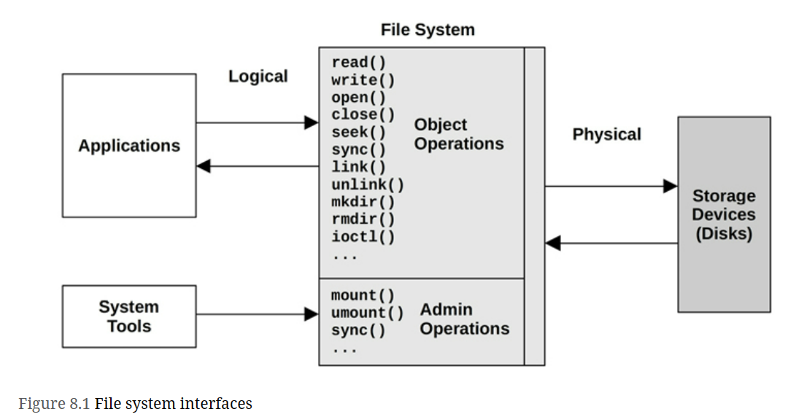
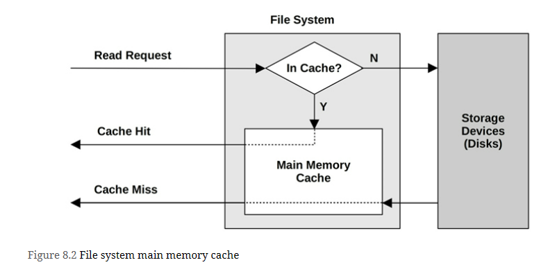

File system performance often matters more to the application than disk or storage device performance, because it is the file system that applications interact with and wait for. File systems can use caching, buffering, and asynchronous I/O to avoid subjecting applications to disk-level (or remote storage system) latency.

# Terminology
**File system**: An organization of data as files and directories, with a file-based interface for accessing them, and file permissions to control access. Additional content may include special file types for devices, sockets, and pipes, and metadata including file access timestamps.

**File system cache**: An area of main memory (usually DRAM) used to cache file system contents, which may include different caches for various data and metadata types.

**Operations**: File system operations are requests of the file system, including read(2), write(2), open(2), close(2), stat(2), mkdir(2), and other operations.

**I/O**: Input/output. File system I/O can be defined in several ways; here it is used to mean only operations that directly read and write (performing I/O), including read(2), write(2), stat(2) (read statistics), and mkdir(2) (write a new directory entry). I/O does not include open(2) and close(2) (although those calls update metadata and can cause indirect disk I/O).

**Logical I/O**: I/O issued by the application to the file system.

**Physical I/O**: I/O issued directly to disks by the file system (or via raw I/O).

**Block size**: Also known as record size, is the size of file system on-disk data groups. See Block vs. Extent in Section 8.4.4, File System Features.

**Throughput**: The current data transfer rate between applications and the file system, measured in bytes per second.

**inode**: An index node (inode) is a data structure containing metadata for a file system object, including permissions, timestamps, and data pointers.

**VFS**: Virtual file system, a kernel interface to abstract and support different file system types.

**Volume**: An instance of storage providing more flexibility than using a whole storage device. A volume may be a portion of a device, or multiple devices.

**Volume manager**: Software for managing physical storage devices in a flexible way, creating virtual volumes for use by the OS.

# Models
## File System Interfaces

## File System Cache

## Second Level Cache

# Concepts
File system latency is the primary metric of file system performance, measured as the time from a logical file system request to its completion. It includes time spent in the file system and disk I/O subsystem, and waiting on disk devices—the physical I/O. Application threads often block during an application request in order to wait for file system requests to complete—in this way, file system latency directly and proportionally affects application performance.

Cases where applications may not be directly affected include the use of non-blocking I/O, prefetch (Section 8.3.4), and when I/O is issued from an asynchronous thread (e.g., a background flush thread)

######################################################################### 8.3.6 (write back caching)
